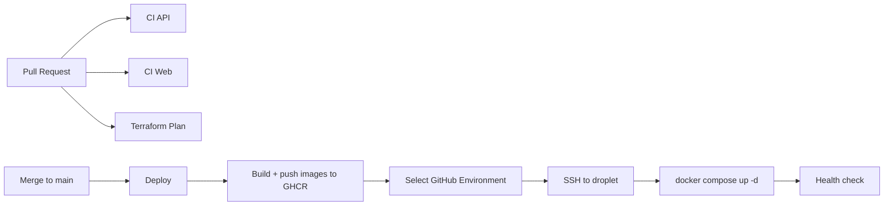

# Deployment

SFA deploys to a DigitalOcean Droplet running Docker Compose behind host Nginx,
with Managed MongoDB. Infrastructure is provisioned with Terraform
(`infra/terraform/`). CI/CD lives in `.github/workflows/`.

## Pipeline overview



## Workflows

| Workflow | File | Trigger | Purpose |
|----------|------|---------|---------|
| CI API | `.github/workflows/ci-api.yml` | PR/push touching api/shared | Build + e2e tests (Mongo service) |
| CI Web | `.github/workflows/ci-web.yml` | PR/push touching web/shared | Type-check + Vite build |
| Terraform Plan | `.github/workflows/terraform-plan.yml` | PR touching `infra/terraform/**` | fmt check + plan/validate dev |
| Deploy | `.github/workflows/deploy.yml` | push to main (dev) / manual (choose env) | Build+push images, SSH deploy, health check |

## Secrets model: GitHub Environments

The `Deploy` workflow uses **GitHub Environments**, not repo-level `DEV_*`/`STAGING_*`
secrets. Create one Environment per target and put the **same secret names** in each,
with environment-specific values. The workflow picks the Environment:

- On push to `main`: deploys to the `dev` Environment.
- On manual run (`workflow_dispatch`): you choose the Environment from a dropdown.

Create Environments at: repo -> **Settings** -> **Environments** -> **New environment**
(`dev`, later `staging`, `production`). Optionally add required reviewers to
`production` for a manual approval gate.

### Environment secrets (same names in every Environment)

| Secret | Description |
|--------|-------------|
| `SSH_HOST` | Droplet public IP (`terraform output -raw droplet_ip`) |
| `SSH_KEY` | Private SSH key for the `deploy` user (matches `ssh_public_key` in tfvars) |
| `MONGODB_URI` | Managed Mongo URI (`terraform output -raw mongodb_uri`) |
| `JWT_ACCESS_SECRET` | `openssl rand -base64 48` |
| `JWT_REFRESH_SECRET` | `openssl rand -base64 48` |
| `CORS_ORIGIN` | Public site URL (dev: `http://<droplet_ip>`) |
| `GHCR_PULL_USER` | GitHub username/bot with `read:packages` |
| `GHCR_PULL_TOKEN` | PAT with `read:packages` (droplet pulls images) |

> Image push uses the built-in `GITHUB_TOKEN` (no secret needed). The droplet
> needs its own read token to pull from GHCR. `GHCR_PULL_USER`/`GHCR_PULL_TOKEN`
> are typically the same across environments — just add them to each Environment.

### Repo-level secrets (Terraform in CI — only for plan-on-PR)

These are account-wide, so keep them at repo level (Settings -> Secrets -> Actions):

| Secret | Description |
|--------|-------------|
| `DO_API_TOKEN` | DigitalOcean API token |
| `TF_STATE_ACCESS_KEY` | Spaces access key (state backend) |
| `TF_STATE_SECRET_KEY` | Spaces secret key (state backend) |
| `SSH_PUBLIC_KEY` | Public SSH key (passed as `TF_VAR_ssh_public_key`) |

## First deploy checklist

1. Provision dev infra: see `infra/terraform/README.md` (`make apply ENV=dev`).
2. Create the `dev` GitHub Environment and add the Environment secrets above
   (`SSH_HOST` and `MONGODB_URI` come from the Terraform outputs).
3. Push to `main` (deploys to `dev`), or run the **Deploy** workflow manually and
   pick the Environment.
4. One-time DB seed (SSH to droplet):
   ```bash
   cd /opt/sfa
   docker compose -f docker-compose.prod.yml run --rm api node packages/api/dist/seed/seed.js
   ```
5. Enable TLS later, once DNS is wired (SSH to droplet):
   ```bash
   sudo certbot --nginx -d dev.example.com
   ```
6. Verify: `http://<droplet_ip>/api/v1/health` (or the domain once DNS/TLS is set).

## Adding staging or production

1. `make create ENV=staging` (see `infra/terraform/README.md`).
2. Create a `staging` (or `production`) GitHub Environment with the same secret names.
3. Run the **Deploy** workflow manually and select that Environment.

## Rollback

Images are tagged by commit SHA in GHCR. To roll back, set `API_IMAGE`/`WEB_IMAGE`
in `/opt/sfa/.env` to a previous SHA and run:

```bash
cd /opt/sfa
docker compose -f docker-compose.prod.yml up -d
```

## Local development

Use the root `docker-compose.yml` (bundled Mongo, auto-seed) via `make up`.
`docker-compose.prod.yml` is for servers only and expects external Mongo.
