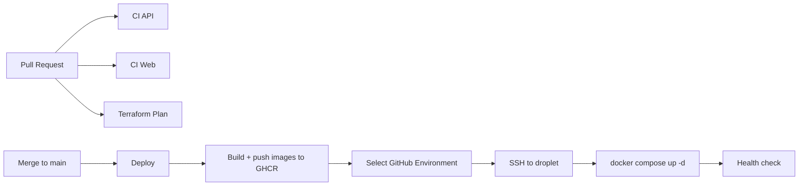

# Deployment

SFA deploys to a DigitalOcean Droplet running Docker Compose behind host Nginx,
with Managed MongoDB. Infrastructure is provisioned with Terraform
(`infra/terraform/`). CI/CD lives in `.github/workflows/`.

## Pipeline overview



## Workflows

| Workflow | File | Trigger | Purpose |
|----------|------|---------|---------|
| CI API | `.github/workflows/ci-api.yml` | PR/push touching api/shared | Build + unit/e2e tests against a single-node Mongo **replica set** |
| CI Web | `.github/workflows/ci-web.yml` | PR/push touching web/shared | Type-check + Vite build |
| Terraform Plan | `.github/workflows/terraform-plan.yml` | PR touching `infra/terraform/**` | fmt check + plan/validate dev |
| Deploy dev | `.github/workflows/deploy-dev.yml` | push to `dev` / manual | Calls the reusable deploy for the `dev` Environment |
| Deploy staging | `.github/workflows/deploy-staging.yml` | manual | Same, `staging` Environment |
| Deploy production | `.github/workflows/deploy-production.yml` | manual | Same, `production` Environment |
| Deploy (reusable) | `.github/workflows/deploy.reusable.yml` | called by the three above | Preflight secret check, build+push images, SSH deploy, health check |

## Secrets model: GitHub Environments

The deploy workflows use **GitHub Environments**, not repo-level `DEV_*`/`STAGING_*`
secrets. Create one Environment per target and put the **same secret names** in each,
with environment-specific values. Each per-environment workflow selects its own
Environment; `secrets: inherit` passes them to the reusable workflow.

- Push to `dev` deploys to the `dev` Environment.
- `staging` and `production` are manual (`workflow_dispatch`).

The reusable workflow's first step fails the run if any required secret is empty.
That guard exists because the two newest ones degrade *silently*: without
`STORAGE_ENDPOINT` the API disables uploads and still reports healthy, and
without `PUBLIC_FORM_BASE_URL` every generated share link points at
`http://localhost:5173`.

Create Environments at: repo -> **Settings** -> **Environments** -> **New environment**
(`dev`, later `staging`, `production`). Optionally add required reviewers to
`production` for a manual approval gate.

### Environment secrets (same names in every Environment)

All of these are **required** — the deploy fails preflight if any is empty.

| Secret | Description |
|--------|-------------|
| `SSH_HOST` | Droplet public IP (`terraform output -raw droplet_ip`) |
| `SSH_KEY` | Private SSH key for the `deploy` user (matches `ssh_public_key` in tfvars) |
| `MONGODB_URI` | Managed Mongo URI (`terraform output -raw mongodb_uri`) |
| `JWT_ACCESS_SECRET` | `openssl rand -base64 48` |
| `JWT_REFRESH_SECRET` | `openssl rand -base64 48` |
| `CORS_ORIGIN` | Public site URL (dev: `http://<droplet_ip>`) |
| `APP_BASE_URL` | Public site URL again, as a **single** URL. Every invite / accept-invite link is built from it. Unset, links are generated pointing at `http://localhost:5173` and arrive dead while everything else looks healthy. |
| `GHCR_PULL_USER` | GitHub username/bot with `read:packages` |
| `GHCR_PULL_TOKEN` | PAT with `read:packages` (droplet pulls images) |
| `PUBLIC_FORM_BASE_URL` | Public site URL; share links are built as `<base>/f/lead/{token}` |
| `STORAGE_ENDPOINT` | `terraform output -raw spaces_endpoint` |
| `STORAGE_REGION` | `terraform output -raw spaces_region` |
| `STORAGE_BUCKET` | `terraform output -raw spaces_bucket` |
| `STORAGE_ACCESS_KEY_ID` | `terraform output -raw spaces_access_key_id` |
| `STORAGE_SECRET_ACCESS_KEY` | `terraform output -raw spaces_secret_access_key` |

Optional tuning knobs for the public intake routes, defaulted in
`packages/api/src/config/rate-limit.config.ts` if left unset: `RATE_LIMIT_SHORT`,
`RATE_LIMIT_LONG`, `PUBLIC_FORM_RATE_LIMIT`, `PUBLIC_INTAKE_RATE_LIMIT`,
`PUBLIC_INTAKE_HOURLY_LIMIT`.

> Image push uses the built-in `GITHUB_TOKEN` (no secret needed). The droplet
> needs its own read token to pull from GHCR. `GHCR_PULL_USER`/`GHCR_PULL_TOKEN`
> are typically the same across environments — just add them to each Environment.

> `PUBLIC_FORM_BASE_URL` and `CORS_ORIGIN` are usually the same value, but they
> are separate secrets on purpose: `CORS_ORIGIN` is a comma-separated allow-list,
> while `PUBLIC_FORM_BASE_URL` is a single URL pasted into links people click.

> The `STORAGE_*` values are the app's runtime credentials and are **not** the
> `TF_STATE_*` keys. Terraform mints a bucket-scoped Spaces key per environment
> (`modules/spaces`), so a leak cannot reach the state bucket or another
> environment's files.

### Async work: Inngest + email

Required **only in Environments where the variable `INNGEST_ENABLED` is `true`**
(a GitHub Environment *variable*, not a secret — it mirrors terraform's
`enable_inngest`, and the preflight, the `deploy-inngest` job and the
infrastructure all read the same flag so they cannot disagree).

| Secret | Description |
|--------|-------------|
| `INNGEST_SSH_HOST` | Inngest droplet public IP (`terraform output -raw inngest_droplet_ip`). SSH only — nothing is served publicly. |
| `INNGEST_BASE_URL` | `http://<terraform output -raw inngest_droplet_private_ip>:8288` — where the API sends events |
| `APP_PRIVATE_IP` | App droplet VPC address (`terraform output -raw droplet_private_ip`). Inngest invokes functions at `<this>:4000/api/inngest`. |
| `INNGEST_EVENT_KEY` | Authenticates events the API sends. `openssl rand -hex 32` |
| `INNGEST_SIGNING_KEY` | Signs Inngest's requests to `/api/inngest`. **Must be hex with an even number of characters** — `openssl rand -hex 32` |
| `RESEND_API_KEY` | Resend API key for outbound email |
| `MAIL_DEFAULT_FROM` | e.g. `AgencyOps <notifications@mail.example.com>` — a domain **verified in Resend** |
| `MAIL_REPLY_TO` | Optional. Reply address surfaced to recipients. |

> **`RESEND_API_KEY` fails silently, which is why preflight checks it.** Unset,
> the worker falls back to a transport that logs instead of sending: the app
> boots, the health check passes, Inngest runs complete successfully, and not one
> email is delivered. Exactly the same failure shape as a missing
> `STORAGE_ENDPOINT`.

> **`INNGEST_SIGNING_KEY` is the only authentication on `/api/inngest`.** That
> endpoint is mounted as raw Express middleware, so none of the seven global
> guards see it. The droplet firewall (port 4000, Inngest droplet only) is the
> second layer.

> ⚠ **Never expose port 8288.** It serves Inngest's Event API, its REST/GraphQL
> API *and* its dashboard UI, and the self-hosted build ships with **no
> authentication on any of them**. The DigitalOcean firewall is the only thing
> keeping it off the public internet. To view the dashboard, tunnel:
> `ssh -L 8288:localhost:8288 deploy@<inngest_droplet_ip>`, then open
> `http://localhost:8288`.

> Inngest persists run state to a SQLite volume (`inngest_data`) with an
> in-memory queue snapshotted to it periodically, so a hard crash can lose
> in-flight run state and a single node cannot be scaled out. Fine at current
> volume; the documented upgrade is `INNGEST_POSTGRES_URI` + `INNGEST_REDIS_URI`,
> which is two environment variables rather than a rewrite. **Back the volume
> up** — losing it loses scheduled-function state and run history.

### Repo-level secrets (Terraform in CI — only for plan-on-PR)

These are account-wide, so keep them at repo level (Settings -> Secrets -> Actions):

| Secret | Description |
|--------|-------------|
| `DO_API_TOKEN` | DigitalOcean API token |
| `TF_STATE_ACCESS_KEY` | Spaces access key — state backend **and** the provider's Spaces credential |
| `TF_STATE_SECRET_KEY` | Spaces secret key (same, both uses) |
| `SSH_PUBLIC_KEY` | Public SSH key (passed as `TF_VAR_ssh_public_key`) |

> Spaces *buckets* are managed over the S3 API rather than the DO API, so the
> `digitalocean` provider needs a Spaces key of its own on top of
> `DO_API_TOKEN`. `terraform-plan.yml` exports the `TF_STATE_*` pair as both
> `AWS_*` (backend) and `SPACES_*` (provider). Locally, export
> `SPACES_ACCESS_KEY_ID` / `SPACES_SECRET_ACCESS_KEY` before `make apply`, or
> the plan fails on `digitalocean_spaces_bucket`.

## Object storage

Document uploads (deal-audit resolutions, intake attachments) go to a
DigitalOcean Space, provisioned per environment by `infra/terraform/modules/spaces`
when `enable_spaces = true` — now the default for dev, staging and production.

The flow is **presigned PUT**: the API signs a URL and the browser sends the
bytes directly to Spaces. Two consequences worth remembering:

- File bytes never pass through Nginx or the API, so no `client_max_body_size`
  tuning is needed. The 10 MB ceiling is enforced at presign time in
  `packages/api/src/deal-audits/dto/presign-attachment.dto.ts`.
- The bucket needs **CORS rules naming the site's origin**, or uploads die on the
  browser preflight while the API looks perfectly healthy. Terraform manages
  these; if the site's origin changes (DNS cutover, enabling TLS), update
  `spaces_cors_origins` and re-apply.

## MongoDB and transactions

The lead-intake pipeline writes lead + household + contacts as one transaction,
which MongoDB only supports on a replica set or a sharded cluster. DO Managed
MongoDB is a replica set even at `mongo_node_count = 1`, so the provisioned
cluster is fine as-is.

This is worth verifying after the first apply, because failure is quiet rather
than loud: `TransactionRunner` probes support at boot and falls back to
compensating deletes with a warning instead of refusing to start. Check the logs:

```bash
docker compose -f /opt/sfa/docker-compose.prod.yml logs api | grep -i transaction
# want: "MongoDB transactions available (replica set / mongos)."
# not:  "MongoDB is NOT a replica set — ..."
```

## First deploy checklist

1. Export both credentials, then provision dev infra — see
   `infra/terraform/README.md` (`make apply ENV=dev`):
   ```bash
   export DIGITALOCEAN_TOKEN=...          # DO API — droplet, VPC, Mongo, DNS
   export SPACES_ACCESS_KEY_ID=...        # S3 API — Spaces bucket + CORS rules
   export SPACES_SECRET_ACCESS_KEY=...
   ```
2. Collect the outputs the Environment secrets need:
   ```bash
   cd infra/terraform/environments/dev
   terraform output -raw droplet_ip
   terraform output -raw mongodb_uri
   terraform output -raw spaces_endpoint
   terraform output -raw spaces_region
   terraform output -raw spaces_bucket
   terraform output -raw spaces_access_key_id
   terraform output -raw spaces_secret_access_key
   terraform output spaces_cors_origins   # sanity-check this covers the site origin
   ```
3. Create the `dev` GitHub Environment and add every Environment secret listed
   above. The deploy's preflight step names any that are missing.
4. Push to `dev`, or run **Deploy dev** manually.
5. One-time DB seed (SSH to droplet):
   ```bash
   cd /opt/sfa
   docker compose -f docker-compose.prod.yml run --rm api node packages/api/dist/seed/seed.js
   ```
6. Enable TLS later, once DNS is wired (SSH to droplet):
   ```bash
   sudo /opt/sfa/enable-tls.sh          # or: sudo certbot --nginx -d dev.example.com
   ```
   Switching to HTTPS changes the browser's `Origin`, so update `CORS_ORIGIN`,
   `PUBLIC_FORM_BASE_URL` and `spaces_cors_origins` at the same time — otherwise
   uploads start failing preflight while everything else keeps working.
7. Verify:
   - `http://<droplet_ip>/api/v1/health` (or the domain once DNS/TLS is set)
   - API log says `MongoDB transactions available` (see above)
   - one real document upload through the UI, end to end — this is the only
     check that actually exercises the presign + bucket CORS path

## Adding staging or production

1. `make create ENV=staging` (see `infra/terraform/README.md`).
2. Create a `staging` (or `production`) GitHub Environment with the same secret names.
3. Run the matching **Deploy staging** / **Deploy production** workflow.

### Every environment needs its own SSH keypair

`stacks/sfa/main.tf` creates a `digitalocean_ssh_key` named `sfa-<env>-deploy`.
DigitalOcean **rejects a second key whose public half is already on the account**, so
reusing another environment's key fails the very first `terraform apply` with a 422 —
before anything is created, and with an error that does not obviously say "duplicate
key". Generate one per environment:

```bash
ssh-keygen -t ed25519 -f ~/.ssh/sfa_<env>_deploy -C "sfa-<env>-deploy" -N ""
```

The public half goes in that environment's tfvars (`ssh_public_key`), the private half
becomes its `SSH_KEY` Environment secret. Separate keys also mean a compromised dev key
cannot reach production.

### Production

Serves **`app.smithfamily.agency`**. Same shape as dev: single app droplet + Inngest
droplet, Managed MongoDB, Spaces, host Nginx with Certbot, `enable_inngest = true`.
Sized identically to dev (`s-1vcpu-2gb` / `db-s-1vcpu-1gb`) — scale vertically until the
load-balanced autoscaling work lands.

Deviations from dev worth knowing:

- **`mongo_allowed_ip_addresses = []`** — dev allow-lists two developer IPs for
  Compass/mongosh; production has no standing hole in the database perimeter. Add a
  named entry only when someone genuinely needs it, and remove it the same day.
- **DNS is manual**, same as dev (`enable_dns = false`) — the zone is at GoDaddy. Point
  an `app` A record at `terraform output -raw droplet_ip` (the reserved IP).
- **No auto-seed and no demo data.** Nothing seeds on startup. Bring the data up by
  hand once TLS is up — see "Data bring-up" below. Never run `seed:demo` against
  production; it writes ~500 synthetic CRM records into the live tenant.

Ordering that matters: `enable_tls = true` is set from the first apply because
`user_data` cannot be changed in place — flipping it later would **replace the droplet**.
First-boot Certbot fails (DNS does not point at the reserved IP yet); cloud-init treats
that as non-fatal. Finish with `sudo /opt/sfa/enable-tls.sh` once the A record resolves,
then seed.

## Data bring-up

Three steps populate a fresh database, in dependency order: seed the tenant,
import the CRM from SmartSuite, import the mailer history from BigQuery.
`scripts/migration/run-migration.sh` runs them with a preflight, a per-step log
and `--from <n>` to resume — see the header comment in the script itself.

Step 2 provisions the tenant (agency, branch, default roles, audit templates)
but creates **no users beyond the ones SmartSuite supplies**, and each of those
gets an unusable password hash and no roles. So after a bring-up the agency has
**no login that can administer it**, and there is no way to bootstrap one from
inside the app — the platform super admin holds no `agency:*` permission, so
inviting the first user 403s, and the platform endpoints cover agency CRUD and
module toggles only.

Step 2 therefore promotes one migrated user to Agency Owner (`--owner-email`,
default `davidhowad@allstate.com`) — a real person from the legacy book, never a
synthetic account. That gives them every `agency:*` permission, so they can
assign roles and send password-reset emails to the rest of the team.

They still need one manual unlock, because their migrated password hash is
unusable and there is no public "forgot password" endpoint: log in as the
platform super admin, `POST /auth/impersonate/:userId` as the owner, then
`POST /users/:userId/password-reset` for that same user to email them a reset
link. After that the tenant is self-sufficient.

Run it **on the droplet**, in `--mode compose`. Two reasons it is not run from a
laptop:

- `packages/api/src/config/env.config.ts` resolves `ENV_FILE_PATH` to the
  repo-root `.env` and offers no override. A real environment variable still
  wins (`@nestjs/config` merges `process.env` last), but every value you *forget*
  to override silently keeps its local one — `STORAGE_*` still on MinIO,
  `APP_BASE_URL` still `http://localhost:5173`, `SEED_SUPER_ADMIN_PASSWORD`
  still the dev password, which the core seed would then write to the real super
  admin. The container carries no repo `.env`, so `/opt/sfa/.env` is the only
  source and the whole class of mistake disappears.
- Production's Managed Mongo admits nothing but the droplet
  (`mongo_allowed_ip_addresses = []`). Reaching it from anywhere else means
  opening the database perimeter on a cluster holding real client data.

```bash
scp scripts/migration/run-migration.sh deploy@<host>:/opt/sfa/
ssh deploy@<host>
cd /opt/sfa
export SMARTSUITE_API_TOKEN=... SMARTSUITE_ACCOUNT_ID=... SMARTSUITE_SOLUTION_ID=...
export BQ_PROJECT_ID=... BQ_DATASET_ID=... BQ_MAILERS_TABLE_ID=...
export GOOGLE_APPLICATION_CREDENTIALS_JSON="$(cat sa.json)"
./run-migration.sh --mode compose --dry-run     # steps 2 + 5 fetch and report, no writes
./run-migration.sh --mode compose
```

The SmartSuite and BigQuery credentials are exported for the run rather than
added to `/opt/sfa/.env`: the deploy workflow rewrites that file in full on every
deploy, so anything put there is lost, and they are read-only source credentials
the running API has no reason to hold.

> **The image must be newer than the webpack entry-list fix.** Every one-shot
> script is a separate webpack entry (`packages/api/webpack.config.js`), and the
> runner stage of the Dockerfile copies `dist` and never `src`. A script that is
> not an entry does not exist on the server, and `node dist/…` fails with
> `MODULE_NOT_FOUND` — which is how the migration, both backfills and both
> permission scripts were unrunnable in a deployed environment while working
> fine locally under ts-node. Deploy first, then bring the data up.

## Rollback

Images are tagged by commit SHA in GHCR. To roll back, set `API_IMAGE`/`WEB_IMAGE`
in `/opt/sfa/.env` to a previous SHA and run:

```bash
cd /opt/sfa
docker compose -f docker-compose.prod.yml up -d
```

Note this edit only survives until the next deploy — the workflow rewrites
`/opt/sfa/.env` in full every run.

## Local development

Use the root `docker-compose.yml` via `make up`: bundled Mongo as a single-node
replica set (`rs0`), MinIO for object storage, and auto-seed on API startup.
`docker-compose.prod.yml` is for servers only and expects external Mongo and
external S3-compatible storage.
