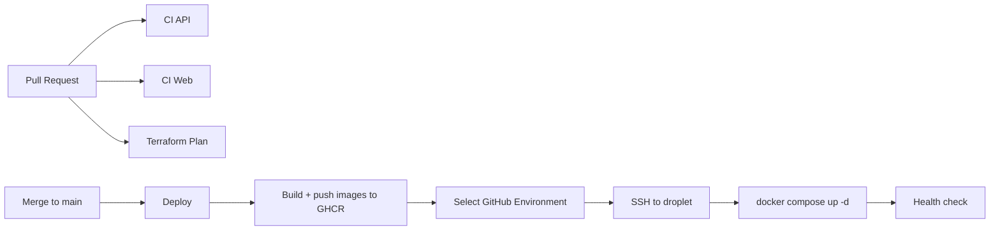

# Deployment

SFA deploys to a DigitalOcean Droplet running Docker Compose behind host Nginx,
with Managed MongoDB. Infrastructure is provisioned with Terraform
(`infra/terraform/`). CI/CD lives in `.github/workflows/`.

## Pipeline overview



## Workflows

| Workflow | File | Trigger | Purpose |
|----------|------|---------|---------|
| CI API | `.github/workflows/ci-api.yml` | PR/push touching api/shared | Build + unit/e2e tests against a single-node Mongo **replica set** |
| CI Web | `.github/workflows/ci-web.yml` | PR/push touching web/shared | Type-check + Vite build |
| Terraform Plan | `.github/workflows/terraform-plan.yml` | PR touching `infra/terraform/**` | fmt check + plan/validate dev |
| Deploy dev | `.github/workflows/deploy-dev.yml` | push to `dev` / manual | Calls the reusable deploy for the `dev` Environment |
| Deploy staging | `.github/workflows/deploy-staging.yml` | manual | Same, `staging` Environment |
| Deploy production | `.github/workflows/deploy-production.yml` | manual | Same, `production` Environment |
| Deploy (reusable) | `.github/workflows/deploy.reusable.yml` | called by the three above | Preflight secret check, build+push images, SSH deploy, health check |

## Secrets model: GitHub Environments

The deploy workflows use **GitHub Environments**, not repo-level `DEV_*`/`STAGING_*`
secrets. Create one Environment per target and put the **same secret names** in each,
with environment-specific values. Each per-environment workflow selects its own
Environment; `secrets: inherit` passes them to the reusable workflow.

- Push to `dev` deploys to the `dev` Environment.
- `staging` and `production` are manual (`workflow_dispatch`).

The reusable workflow's first step fails the run if any required secret is empty.
That guard exists because the two newest ones degrade *silently*: without
`STORAGE_ENDPOINT` the API disables uploads and still reports healthy, and
without `PUBLIC_FORM_BASE_URL` every generated share link points at
`http://localhost:5173`.

Create Environments at: repo -> **Settings** -> **Environments** -> **New environment**
(`dev`, later `staging`, `production`). Optionally add required reviewers to
`production` for a manual approval gate.

### Environment secrets (same names in every Environment)

All of these are **required** — the deploy fails preflight if any is empty.

| Secret | Description |
|--------|-------------|
| `SSH_HOST` | Droplet public IP (`terraform output -raw droplet_ip`) |
| `SSH_KEY` | Private SSH key for the `deploy` user (matches `ssh_public_key` in tfvars) |
| `MONGODB_URI` | Managed Mongo URI (`terraform output -raw mongodb_uri`) |
| `JWT_ACCESS_SECRET` | `openssl rand -base64 48` |
| `JWT_REFRESH_SECRET` | `openssl rand -base64 48` |
| `CORS_ORIGIN` | Public site URL (dev: `http://<droplet_ip>`) |
| `GHCR_PULL_USER` | GitHub username/bot with `read:packages` |
| `GHCR_PULL_TOKEN` | PAT with `read:packages` (droplet pulls images) |
| `PUBLIC_FORM_BASE_URL` | Public site URL; share links are built as `<base>/f/lead/{token}` |
| `STORAGE_ENDPOINT` | `terraform output -raw spaces_endpoint` |
| `STORAGE_REGION` | `terraform output -raw spaces_region` |
| `STORAGE_BUCKET` | `terraform output -raw spaces_bucket` |
| `STORAGE_ACCESS_KEY_ID` | `terraform output -raw spaces_access_key_id` |
| `STORAGE_SECRET_ACCESS_KEY` | `terraform output -raw spaces_secret_access_key` |

Optional tuning knobs for the public intake routes, defaulted in
`packages/api/src/config/rate-limit.config.ts` if left unset: `RATE_LIMIT_SHORT`,
`RATE_LIMIT_LONG`, `PUBLIC_FORM_RATE_LIMIT`, `PUBLIC_INTAKE_RATE_LIMIT`,
`PUBLIC_INTAKE_HOURLY_LIMIT`.

> Image push uses the built-in `GITHUB_TOKEN` (no secret needed). The droplet
> needs its own read token to pull from GHCR. `GHCR_PULL_USER`/`GHCR_PULL_TOKEN`
> are typically the same across environments — just add them to each Environment.

> `PUBLIC_FORM_BASE_URL` and `CORS_ORIGIN` are usually the same value, but they
> are separate secrets on purpose: `CORS_ORIGIN` is a comma-separated allow-list,
> while `PUBLIC_FORM_BASE_URL` is a single URL pasted into links people click.

> The `STORAGE_*` values are the app's runtime credentials and are **not** the
> `TF_STATE_*` keys. Terraform mints a bucket-scoped Spaces key per environment
> (`modules/spaces`), so a leak cannot reach the state bucket or another
> environment's files.

### Repo-level secrets (Terraform in CI — only for plan-on-PR)

These are account-wide, so keep them at repo level (Settings -> Secrets -> Actions):

| Secret | Description |
|--------|-------------|
| `DO_API_TOKEN` | DigitalOcean API token |
| `TF_STATE_ACCESS_KEY` | Spaces access key — state backend **and** the provider's Spaces credential |
| `TF_STATE_SECRET_KEY` | Spaces secret key (same, both uses) |
| `SSH_PUBLIC_KEY` | Public SSH key (passed as `TF_VAR_ssh_public_key`) |

> Spaces *buckets* are managed over the S3 API rather than the DO API, so the
> `digitalocean` provider needs a Spaces key of its own on top of
> `DO_API_TOKEN`. `terraform-plan.yml` exports the `TF_STATE_*` pair as both
> `AWS_*` (backend) and `SPACES_*` (provider). Locally, export
> `SPACES_ACCESS_KEY_ID` / `SPACES_SECRET_ACCESS_KEY` before `make apply`, or
> the plan fails on `digitalocean_spaces_bucket`.

## Object storage

Document uploads (deal-audit resolutions, intake attachments) go to a
DigitalOcean Space, provisioned per environment by `infra/terraform/modules/spaces`
when `enable_spaces = true` — now the default for dev, staging and production.

The flow is **presigned PUT**: the API signs a URL and the browser sends the
bytes directly to Spaces. Two consequences worth remembering:

- File bytes never pass through Nginx or the API, so no `client_max_body_size`
  tuning is needed. The 10 MB ceiling is enforced at presign time in
  `packages/api/src/deal-audits/dto/presign-attachment.dto.ts`.
- The bucket needs **CORS rules naming the site's origin**, or uploads die on the
  browser preflight while the API looks perfectly healthy. Terraform manages
  these; if the site's origin changes (DNS cutover, enabling TLS), update
  `spaces_cors_origins` and re-apply.

## MongoDB and transactions

The lead-intake pipeline writes lead + household + contacts as one transaction,
which MongoDB only supports on a replica set or a sharded cluster. DO Managed
MongoDB is a replica set even at `mongo_node_count = 1`, so the provisioned
cluster is fine as-is.

This is worth verifying after the first apply, because failure is quiet rather
than loud: `TransactionRunner` probes support at boot and falls back to
compensating deletes with a warning instead of refusing to start. Check the logs:

```bash
docker compose -f /opt/sfa/docker-compose.prod.yml logs api | grep -i transaction
# want: "MongoDB transactions available (replica set / mongos)."
# not:  "MongoDB is NOT a replica set — ..."
```

## First deploy checklist

1. Export both credentials, then provision dev infra — see
   `infra/terraform/README.md` (`make apply ENV=dev`):
   ```bash
   export DIGITALOCEAN_TOKEN=...          # DO API — droplet, VPC, Mongo, DNS
   export SPACES_ACCESS_KEY_ID=...        # S3 API — Spaces bucket + CORS rules
   export SPACES_SECRET_ACCESS_KEY=...
   ```
2. Collect the outputs the Environment secrets need:
   ```bash
   cd infra/terraform/environments/dev
   terraform output -raw droplet_ip
   terraform output -raw mongodb_uri
   terraform output -raw spaces_endpoint
   terraform output -raw spaces_region
   terraform output -raw spaces_bucket
   terraform output -raw spaces_access_key_id
   terraform output -raw spaces_secret_access_key
   terraform output spaces_cors_origins   # sanity-check this covers the site origin
   ```
3. Create the `dev` GitHub Environment and add every Environment secret listed
   above. The deploy's preflight step names any that are missing.
4. Push to `dev`, or run **Deploy dev** manually.
5. One-time DB seed (SSH to droplet):
   ```bash
   cd /opt/sfa
   docker compose -f docker-compose.prod.yml run --rm api node packages/api/dist/seed/seed.js
   ```
6. Enable TLS later, once DNS is wired (SSH to droplet):
   ```bash
   sudo /opt/sfa/enable-tls.sh          # or: sudo certbot --nginx -d dev.example.com
   ```
   Switching to HTTPS changes the browser's `Origin`, so update `CORS_ORIGIN`,
   `PUBLIC_FORM_BASE_URL` and `spaces_cors_origins` at the same time — otherwise
   uploads start failing preflight while everything else keeps working.
7. Verify:
   - `http://<droplet_ip>/api/v1/health` (or the domain once DNS/TLS is set)
   - API log says `MongoDB transactions available` (see above)
   - one real document upload through the UI, end to end — this is the only
     check that actually exercises the presign + bucket CORS path

## Adding staging or production

1. `make create ENV=staging` (see `infra/terraform/README.md`).
2. Create a `staging` (or `production`) GitHub Environment with the same secret names.
3. Run the matching **Deploy staging** / **Deploy production** workflow.

## Rollback

Images are tagged by commit SHA in GHCR. To roll back, set `API_IMAGE`/`WEB_IMAGE`
in `/opt/sfa/.env` to a previous SHA and run:

```bash
cd /opt/sfa
docker compose -f docker-compose.prod.yml up -d
```

Note this edit only survives until the next deploy — the workflow rewrites
`/opt/sfa/.env` in full every run.

## Local development

Use the root `docker-compose.yml` via `make up`: bundled Mongo as a single-node
replica set (`rs0`), MinIO for object storage, and auto-seed on API startup.
`docker-compose.prod.yml` is for servers only and expects external Mongo and
external S3-compatible storage.
