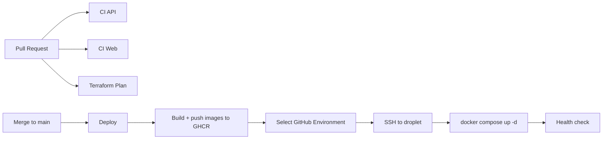

# Deployment

SFA deploys to DigitalOcean as Docker Compose with Managed MongoDB. Dev and
production run the **autoscale pool** shape — interchangeable app droplets behind
a load balancer, TLS terminated by our own Node edge from certificates held in
Mongo. The older shape (one droplet, host Nginx or Caddy) is still what the flags
default to, so an environment that has not moved plans and deploys unchanged.
Infrastructure is provisioned with Terraform (`infra/terraform/`). CI/CD lives in
`.github/workflows/`.

## Pipeline overview



## Workflows

| Workflow | File | Trigger | Purpose |
|----------|------|---------|---------|
| CI API | `.github/workflows/ci-api.yml` | PR/push touching api/shared | Build + unit/e2e tests against a single-node Mongo **replica set** |
| CI Web | `.github/workflows/ci-web.yml` | PR/push touching web/shared | Type-check + Vite build |
| Terraform Plan | `.github/workflows/terraform-plan.yml` | PR touching `infra/terraform/**` | fmt check + plan/validate dev |
| Deploy dev | `.github/workflows/deploy-dev.yml` | push to `dev` / manual | Calls the reusable deploy for the `dev` Environment |
| Deploy staging | `.github/workflows/deploy-staging.yml` | manual | Same, `staging` Environment |
| Deploy production | `.github/workflows/deploy-production.yml` | manual | Same, `production` Environment |
| Deploy (reusable) | `.github/workflows/deploy.reusable.yml` | called by the three above | Preflight secret check, build+push images, SSH deploy, health check |

## Secrets model: GitHub Environments

The deploy workflows use **GitHub Environments**, not repo-level `DEV_*`/`STAGING_*`
secrets. Create one Environment per target and put the **same secret names** in each,
with environment-specific values. Each per-environment workflow selects its own
Environment; `secrets: inherit` passes them to the reusable workflow.

- Push to `dev` deploys to the `dev` Environment.
- `staging` and `production` are manual (`workflow_dispatch`).

The reusable workflow's first step fails the run if any required secret is empty.
That guard exists because the two newest ones degrade *silently*: without
`STORAGE_ENDPOINT` the API disables uploads and still reports healthy, and
without `PUBLIC_FORM_BASE_URL` every generated share link points at
`http://localhost:5173`.

Create Environments at: repo -> **Settings** -> **Environments** -> **New environment**
(`dev`, later `staging`, `production`). Optionally add required reviewers to
`production` for a manual approval gate.

### Environment secrets (same names in every Environment)

All of these are **required** — the deploy fails preflight if any is empty.

| Secret | Description |
|--------|-------------|
| `SSH_HOST` | App droplet public IP (`terraform output -raw droplet_ip`). **Not required where `AUTOSCALE_ENABLED=true`** — a pool is deployed to by publishing, and it has no stable droplet address. |
| `SSH_KEY` | Private SSH key for the `deploy` user (matches `ssh_public_key` in tfvars) |
| `MONGODB_URI` | Managed Mongo URI (`terraform output -raw mongodb_uri`) |
| `JWT_ACCESS_SECRET` | `openssl rand -base64 48` |
| `JWT_REFRESH_SECRET` | `openssl rand -base64 48` |
| `CORS_ORIGIN` | Public site URL, e.g. `https://app.smithfamily.agency`. Must match the scheme the browser actually uses, and `spaces_cors_origins` in tfvars. |
| `APP_BASE_URL` | Public site URL again, as a **single** URL. Every invite / accept-invite link is built from it. Unset, links are generated pointing at `http://localhost:5173` and arrive dead while everything else looks healthy. |
| `GHCR_PULL_USER` | GitHub username/bot with `read:packages` |
| `GHCR_PULL_TOKEN` | PAT with `read:packages` (droplet pulls images) |
| `PUBLIC_FORM_BASE_URL` | Public site URL; share links are built as `<base>/f/lead/{token}` |
| `PLATFORM_HOST` | The one **hostname** (not URL) the super-admin app answers on, e.g. `app.smithfamily.agency`. Access control, not cosmetics: agency users are refused here and platform admins are refused on agency hosts. A wrong value presents as "nobody can log in". |
| `STORAGE_ENDPOINT` | `terraform output -raw spaces_endpoint` |
| `STORAGE_REGION` | `terraform output -raw spaces_region` |
| `STORAGE_BUCKET` | `terraform output -raw spaces_bucket` |
| `STORAGE_ACCESS_KEY_ID` | `terraform output -raw spaces_access_key_id` |
| `STORAGE_SECRET_ACCESS_KEY` | `terraform output -raw spaces_secret_access_key` |

Optional tuning knobs for the public intake routes, defaulted in
`packages/api/src/config/rate-limit.config.ts` if left unset: `RATE_LIMIT_SHORT`,
`RATE_LIMIT_LONG`, `PUBLIC_FORM_RATE_LIMIT`, `PUBLIC_INTAKE_RATE_LIMIT`,
`PUBLIC_INTAKE_HOURLY_LIMIT`.

Optional white-label settings (see "White labelling: agency domains" below):
`BASE_DOMAIN` — the parent zone agency subdomains are issued under; unset
disables subdomains, custom domains still work. `PUBLIC_SERVER_IPS` — public
IP(s), so the settings UI can tell an owner what to put in an A record.

> Image push uses the built-in `GITHUB_TOKEN` (no secret needed). The droplet
> needs its own read token to pull from GHCR. `GHCR_PULL_USER`/`GHCR_PULL_TOKEN`
> are typically the same across environments — just add them to each Environment.

> `PUBLIC_FORM_BASE_URL` and `CORS_ORIGIN` are usually the same value, but they
> are separate secrets on purpose: `CORS_ORIGIN` is a comma-separated allow-list,
> while `PUBLIC_FORM_BASE_URL` is a single URL pasted into links people click.

> The `STORAGE_*` values are the app's runtime credentials and are **not** the
> `TF_STATE_*` keys. Terraform mints a bucket-scoped Spaces key per environment
> (`modules/spaces`), so a leak cannot reach the state bucket or another
> environment's files.

### Async work: Inngest + email

Required **only in Environments where the variable `INNGEST_ENABLED` is `true`**
(a GitHub Environment *variable*, not a secret — it mirrors terraform's
`enable_inngest`, and the preflight, the `deploy-inngest` job and the
infrastructure all read the same flag so they cannot disagree).

> **The worker is its own container, and that is not optional.** Exactly one
> process may serve the Inngest functions: with the worker inline, every API
> process registers under the same Inngest app id and whichever synced last
> wins. That is invisible while there is one node and breaks async work outright
> on an autoscaled tier, so the deploy writes `WORKER_INLINE=false` and starts
> the `worker` service unconditionally.
>
> The consequences to keep straight, because three places have to agree:
> Inngest invokes functions at `<APP_PRIVATE_IP>:4001/api/inngest`, the DO
> firewall admits **4001** (not 4000) from the Inngest droplet, and the API is
> published on loopback only. Get one of the three wrong and Inngest reports
> healthy while syncing zero functions — which the `deploy-inngest` job's
> `functionCount > 0` assertion is there to catch.

| Secret | Description |
|--------|-------------|
| `INNGEST_SSH_HOST` | Inngest droplet public IP (`terraform output -raw inngest_droplet_ip`). SSH only — nothing is served publicly. |
| `INNGEST_BASE_URL` | `http://<terraform output -raw inngest_droplet_private_ip>:8288` — where the API sends events |
| `APP_PRIVATE_IP` | App droplet VPC address (`terraform output -raw droplet_private_ip`). Inngest invokes functions at `<this>:4001/api/inngest` — the **worker** container's port. The API serves no functions. |
| `INNGEST_EVENT_KEY` | Authenticates events the API sends. `openssl rand -hex 32` |
| `INNGEST_SIGNING_KEY` | Signs Inngest's requests to `/api/inngest`. **Must be hex with an even number of characters** — `openssl rand -hex 32` |
| `RESEND_API_KEY` | Resend API key for outbound email |
| `MAIL_DEFAULT_FROM` | e.g. `AgencyOps <notifications@mail.example.com>` — a domain **verified in Resend** |
| `MAIL_REPLY_TO` | Optional. Reply address surfaced to recipients. |

> **`RESEND_API_KEY` fails silently, which is why preflight checks it.** Unset,
> the worker falls back to a transport that logs instead of sending: the app
> boots, the health check passes, Inngest runs complete successfully, and not one
> email is delivered. Exactly the same failure shape as a missing
> `STORAGE_ENDPOINT`.

> **`INNGEST_SIGNING_KEY` is the only authentication on `/api/inngest`.** That
> endpoint is mounted as raw Express middleware, so none of the seven global
> guards see it. The droplet firewall (port 4001, Inngest droplet only) is the
> second layer.

> ⚠ **Never expose port 8288.** It serves Inngest's Event API, its REST/GraphQL
> API *and* its dashboard UI, and the self-hosted build ships with **no
> authentication on any of them**. The DigitalOcean firewall is the only thing
> keeping it off the public internet. To view the dashboard, tunnel:
> `ssh -L 8288:localhost:8288 deploy@<inngest_droplet_ip>`, then open
> `http://localhost:8288`.

> Inngest persists run state to a SQLite volume (`inngest_data`) with an
> in-memory queue snapshotted to it periodically, so a hard crash can lose
> in-flight run state and a single node cannot be scaled out. Fine at current
> volume; the documented upgrade is `INNGEST_POSTGRES_URI` + `INNGEST_REDIS_URI`,
> which is two environment variables rather than a rewrite. **Back the volume
> up** — losing it loses scheduled-function state and run history.

### TLS certificates (application-managed ACME)

Required **only in Environments where the variable `ACME_ENABLED` is `true`**
(a GitHub Environment *variable*, same shape as `INNGEST_ENABLED`).

The platform issues its own certificates — for the platform host, agency
subdomains and agency-owned custom domains — and stores them in the
`certificates` collection. That is what lets every app node serve every
hostname, and therefore what lets the app tier scale horizontally.

| Secret | Description |
|--------|-------------|
| `ACME_DIRECTORY_URL` | `production`, `staging`, or a full directory URL. **Required when enabled**, because the default is staging and staging certificates are not trusted by browsers. |
| `CERT_ENCRYPTION_KEY` | Encrypts private keys at rest. `openssl rand -base64 32`, **different per environment**. |
| `ACME_CONTACT_EMAIL` | Optional. Registered with the CA for expiry notices. |

> **`ACME_ENABLED` must stay `false` until the Node edge owns port 80.** The CA
> validates by fetching a plain-HTTP URL on the hostname being issued, so
> whatever listens on port 80 has to answer it. While Caddy is the edge it
> answers its own challenges and knows nothing of ours, so every order fails
> validation — and failed validations spend a Let's Encrypt limit that is
> separate from the issuance limit and blocks orders that would have succeeded.

> **Losing `CERT_ENCRYPTION_KEY` is not immediately visible.** Nodes that
> already hold a decrypted certificate keep serving with it. The failure appears
> when a node restarts or a new one joins the pool — it can decrypt nothing, and
> serves no TLS at all. Recovery is to set a new key and re-issue every
> certificate, so treat this as a secret to back up rather than one to regenerate.

### The edge: Caddy or our own

Which edge an environment runs is decided by **two flags that must agree**:

| Where | Flag | Effect |
|---|---|---|
| GitHub Environment *variable* | `NODE_EDGE_ENABLED` | Starts the `edge` + `worker` containers, sets `WORKER_INLINE=false`, points Inngest at 4001 |
| `terraform.tfvars` | `enable_node_edge` | Opens firewall 4001 instead of 4000, and selects the cloud-init **without** Caddy |

Both default to false, which is Caddy plus an inline worker. **Dev and
production both have them on**; the defaults exist so that a new environment,
and any environment still on the old shape, plans clean.

> **They are two flags because they are applied by two different things.** The
> deploy runs from a git branch; terraform runs from someone's laptop. There is
> no single place that could set both, so the failure mode is that one moves
> without the other:
>
> - terraform on, deploy off → no Caddy, no edge container. Nothing serves
>   port 443 at all.
> - deploy on, terraform off → the edge runs, but the firewall admits 4000
>   while the worker listens on 4001. Inngest reports healthy, syncs zero
>   functions, and not one email is sent. The `deploy-inngest` job's
>   `functionCount > 0` assertion is what catches this.
>
> This is the same shape as `INNGEST_ENABLED`/`enable_inngest`, and for the same
> reason.

> **Flipping `enable_node_edge` REPLACES the app droplet.** `user_data` cannot
> be changed in place. The reserved IP re-attaches so the public address
> survives, but the box is rebuilt — expect to re-run the seed. That is why the
> two cloud-init templates are separate files chosen by the flag rather than one
> template with a conditional: editing the file production uses would replace
> production.

#### Cutting production over

The terraform half is already in the repo — `environments/production` carries
`enable_node_edge = true` and `enable_autoscale = true`. What follows is the
sequence for the apply itself, and the order is load-bearing.

> **Read this first: production goes down, and the rollback is not symmetric.**
>
> The apply destroys the reserved IP that `app.smithfamily.agency` currently
> resolves to. From that moment nothing serves production until DNS points at
> the balancer *and* the deploy has published *and* the worker has issued a
> certificate — in that order, because Let's Encrypt validates by fetching a
> plain-HTTP URL on the hostname, so DNS has to be right before issuance can
> even be attempted. Budget **30–60 minutes**, most of it DNS propagation.
>
> Rolling back is another cutover, not an undo: flipping the flags off builds a
> *new* droplet with a *new* reserved IP, and DNS has to move again. The old
> address is released by DigitalOcean and is not recoverable.

**Before the day.** Drop the TTL on the `app` and `*.app` A records at GoDaddy to
600s at least a few hours ahead — whatever the TTL is when you start is how long
the dead address stays cached. Generate production's `CERT_ENCRYPTION_KEY` now
(`openssl rand -base64 32`) and put it somewhere it can be recovered from; it is
a secret to **back up**, not one to regenerate, because losing it means
re-issuing every certificate the platform holds.

1. **Plan and read it.**

   ```bash
   make plan ENV=production
   ```

   Expect exactly: the app droplet and its reserved IP **destroyed**; the
   `sfa-production-pool` tag, the deploy-config bucket and its two keys, the
   autoscale pool and **two** load balancers **created**; the firewall's 80/443
   rules re-sourced to the public balancer with 8081 and 4001 added; the Mongo
   allow-list and the Inngest firewall moving from droplet ids to the pool tag.
   Anything touching the **VPC or the Managed MongoDB cluster** is a stop —
   those carry the data.

2. **Apply.** `make apply ENV=production`. Production is down from here.

3. **Collect the new addresses.**

   ```bash
   cd infra/terraform/environments/production
   terraform output -raw public_ip        # the public balancer
   terraform output -raw worker_endpoint  # the internal balancer = APP_PRIVATE_IP
   terraform output deploy_config_github_secrets
   terraform output -raw deploy_config_secret_key
   ```

   `-raw` prints no trailing newline, so zsh shows a trailing `%`. It is not
   part of the value.

4. **Move DNS at GoDaddy — both records.** `app` and `*.app`, to `public_ip`.
   The wildcard is the one that gets forgotten, and missing it takes out every
   agency subdomain while the platform host looks perfectly healthy.

5. **Wait for DNS, and check before deploying.** `dig +short app.smithfamily.agency`
   and `dig +short anything.app.smithfamily.agency` must both return the
   balancer. Do not run the deploy with `ACME_ENABLED=true` until they do:
   every order placed against a hostname that does not resolve here fails
   validation, and failed validations spend a Let's Encrypt limit that is
   separate from the issuance one and blocks orders that would have succeeded.

6. **Set the production Environment values.** Secrets:

   | Secret | Value |
   |---|---|
   | `PUBLIC_SERVER_IPS` | `public_ip` from step 3 |
   | `APP_PRIVATE_IP` | `worker_endpoint` — the **internal balancer**, never a member's own address |
   | `DEPLOY_CONFIG_BUCKET` / `_ENDPOINT` / `_REGION` / `_ACCESS_KEY_ID` | `deploy_config_github_secrets` |
   | `DEPLOY_CONFIG_SECRET_ACCESS_KEY` | `deploy_config_secret_key` |
   | `CERT_ENCRYPTION_KEY` | the key generated above — **production's own**, not dev's |
   | `ACME_DIRECTORY_URL` | `production` |

   Variables — all four, or the halves disagree:

   | Variable | Value | Paired with |
   |---|---|---|
   | `NODE_EDGE_ENABLED` | `true` | `enable_node_edge` |
   | `AUTOSCALE_ENABLED` | `true` | `enable_autoscale` |
   | `ACME_ENABLED` | `true` | the Node edge owning port 80 |
   | `EDGE_PROXY_PROTOCOL` | `true` | `pool_proxy_protocol` |

7. **Run *Deploy production*.** It publishes to the config bucket rather than
   SSHing; members converge within ~30s of the publish, so the rollout is not
   instant. The job's own `functionCount > 0` assertion is what catches an
   Inngest port mismatch.

8. **Verify, in this order** — each rules out a different half:

   ```bash
   # balancer + edge, before TLS is in the picture
   curl -sS -o /dev/null -w '%{http_code}\n' http://app.smithfamily.agency/healthz

   # the certificate actually issued, and from the real CA
   echo | openssl s_client -connect app.smithfamily.agency:443 \
       -servername app.smithfamily.agency 2>/dev/null \
       | openssl x509 -noout -issuer -dates

   # a tenant subdomain, which is what the wildcard record is for
   curl -sS -o /dev/null -w '%{http_code}\n' https://<agency>.app.smithfamily.agency/healthz
   ```

   `(STAGING)` in the issuer means `ACME_DIRECTORY_URL` is wrong — browsers will
   not trust it. Then confirm both pool members show healthy in the DigitalOcean
   console, and send one real email to prove the worker is reachable on 4001.

> **Scaling the app tier does not scale what is behind it.** Production Mongo is
> still `node_count = 1` with no backups, there is no Redis so every request
> resolves permissions from Mongo, Inngest is one droplet with SQLite, and the
> rate limits are per-node once the pool grows past one. None of that blocks the
> cutover; all of it is Phase 5.

### Horizontal autoscaling

The app tier can run as an autoscale pool behind a load balancer instead of one
directly-addressed droplet. Controlled by **two flags that must agree**, both
defaulting to off:

| Where | Flag |
|---|---|
| GitHub Environment *variable* | `AUTOSCALE_ENABLED` |
| `terraform.tfvars` | `enable_autoscale` (+ `pool_min_instances`, `pool_max_instances`, `pool_target_cpu`) |

`enable_autoscale` **requires** `enable_node_edge`. The pool depends on every
node being interchangeable, and that is only true once certificates come from
MongoDB rather than a node's disk — with Caddy each droplet would run its own
ACME client and race the others for the same tenant hostnames. The deploy's
preflight fails if the two disagree.

#### Deploys change shape

**Pool members are never deployed to.** A droplet created during a traffic spike
has nothing to SSH to it, so the deploy *publishes* instead:

```
CI ──> s3://<env>-deploy-config/current/{docker-compose.prod.yml,app.env}
                    ↑ every droplet fetches this at boot and every 30s
```

Each droplet runs `sfa-converge` on a systemd timer. It checksums both files
together and does nothing unless they changed, so a droplet up for a month and
one created a second ago reach the same state by the same path. Deploy latency
is therefore ~30s rather than instant.

> **Do not hand-edit `/opt/sfa/.env` on a pool member.** The next tick overwrites
> it. Change the Environment secret and re-run the deploy.

Debugging a member:

```bash
journalctl -u sfa-converge -n 50     # what it fetched and whether it applied
/usr/local/bin/sfa-converge          # force a check now
```

#### Two load balancers

- **Public** — TLS **passthrough**, so our own edge still terminates. Terminating
  at the balancer would mean DigitalOcean holding a certificate per hostname,
  and for an agency-owned domain that is a manual upload per domain — the
  operator step white-labelling exists to remove.
- **Internal** (`REGIONAL_NETWORK`/`INTERNAL`, no public address) — how Inngest
  reaches the workers. `APP_PRIVATE_IP` becomes this balancer's address
  (`terraform output worker_endpoint`), which is stable across scaling.

> **The public balancer health-checks port 8081, not 80.** With PROXY protocol
> on, the balancer's own check carries no PROXY header, so the edge would drop
> it as malformed — every droplet marked unhealthy, the pool serving nothing,
> each droplet in fact fine. 8081 is a plain listener the edge never wraps, and
> the firewall admits it from the balancer alone.

> **`pool_proxy_protocol` and `EDGE_PROXY_PROTOCOL` must match.** Either alone
> breaks every connection: the header is read as the first bytes of a TLS
> handshake, or it never arrives and the edge drops the connection. With it off,
> every caller appears to come from the balancer and the public intake rate
> limits collapse into one shared bucket.

#### The reserved IP goes away, and that is a DNS cutover

A reserved IP attaches to a *droplet* (`digitalocean_reserved_ip_assignment`
takes a `droplet_id` and nothing else), so it cannot front a pool. It lives
inside the droplet module, which autoscaling removes — so **enabling the pool
destroys the reserved IP**, DigitalOcean releases it, and the environment's
public address becomes the load balancer's.

The balancer's own address is stable for the life of the balancer, which is why
`modules/loadbalancer` carries `create_before_destroy`: replacing one hands out
a new address and breaks every tenant domain until DNS is updated everywhere.

Get it with:

```bash
terraform -chdir=infra/terraform/environments/<env> output -raw public_ip
```

Then update **three** things. Missing any one of them fails silently:

| What | Where | If missed |
|---|---|---|
| `<host>` A — `dev` / `app` | GoDaddy | The platform host stops resolving |
| `*.<host>` A — `*.dev` / `*.app` | GoDaddy | **Every agency subdomain stops resolving** |
| `PUBLIC_SERVER_IPS` | Environment secret | Custom-domain owners are told to point an A record at a dead address |

That last one is the quietest. TXT verification is independent of routing, so the
domain still goes `active` — but Let's Encrypt cannot reach the host, the
certificate never issues, and the owner sees a domain marked live that does not
load. `pointsAtUs()` does record "Ownership verified, but …" in `lastError`,
which is the only place it surfaces.

Owners who used the **CNAME** rather than the A record self-correct, because the
CNAME points at the platform host by name.

#### Everything is addressed by tag

The pool's droplets do not exist at plan time and change as it scales, so the
firewall, **the Managed MongoDB allow-list**, and both balancers all target the
`sfa-<env>-pool` tag. An id-based rule would admit only the droplets that existed
at the last apply and silently refuse every one created since — which presents
as one node serving 500s while its siblings are fine.

#### Extra Environment secrets

| Secret | From |
|---|---|
| `DEPLOY_CONFIG_BUCKET` / `_ENDPOINT` / `_REGION` / `_ACCESS_KEY_ID` | `terraform output deploy_config_github_secrets` |
| `DEPLOY_CONFIG_SECRET_ACCESS_KEY` | `terraform output -raw deploy_config_secret_key` |

That key is **read/write and CI-only**. Droplets hold a separate read-only key
that terraform bakes into `user_data` and which never passes through GitHub — so
a compromised droplet cannot rewrite the config every other droplet is about to
fetch.

### Repo-level secrets (Terraform in CI — only for plan-on-PR)

These are account-wide, so keep them at repo level (Settings -> Secrets -> Actions):

| Secret | Description |
|--------|-------------|
| `DO_API_TOKEN` | DigitalOcean API token |
| `TF_STATE_ACCESS_KEY` | Spaces access key — state backend **and** the provider's Spaces credential |
| `TF_STATE_SECRET_KEY` | Spaces secret key (same, both uses) |
| `SSH_PUBLIC_KEY` | Public SSH key (passed as `TF_VAR_ssh_public_key`) |

> Spaces *buckets* are managed over the S3 API rather than the DO API, so the
> `digitalocean` provider needs a Spaces key of its own on top of
> `DO_API_TOKEN`. `terraform-plan.yml` exports the `TF_STATE_*` pair as both
> `AWS_*` (backend) and `SPACES_*` (provider). Locally, export
> `SPACES_ACCESS_KEY_ID` / `SPACES_SECRET_ACCESS_KEY` before `make apply`, or
> the plan fails on `digitalocean_spaces_bucket`.

## Object storage

Document uploads (deal-audit resolutions, intake attachments) go to a
DigitalOcean Space, provisioned per environment by `infra/terraform/modules/spaces`
when `enable_spaces = true` — now the default for dev, staging and production.

The flow is **presigned PUT**: the API signs a URL and the browser sends the
bytes directly to Spaces. Two consequences worth remembering:

- File bytes never pass through Nginx or the API, so no `client_max_body_size`
  tuning is needed. The 10 MB ceiling is enforced at presign time in
  `packages/api/src/deal-audits/dto/presign-attachment.dto.ts`.
- The bucket needs **CORS rules naming the site's origin**, or uploads die on the
  browser preflight while the API looks perfectly healthy. Terraform manages
  these; if the site's origin changes (DNS cutover, enabling TLS), update
  `spaces_cors_origins` and re-apply.

## MongoDB and transactions

The lead-intake pipeline writes lead + household + contacts as one transaction,
which MongoDB only supports on a replica set or a sharded cluster. DO Managed
MongoDB is a replica set even at `mongo_node_count = 1`, so the provisioned
cluster is fine as-is.

This is worth verifying after the first apply, because failure is quiet rather
than loud: `TransactionRunner` probes support at boot and falls back to
compensating deletes with a warning instead of refusing to start. Check the logs:

```bash
docker compose -f /opt/sfa/docker-compose.prod.yml logs api | grep -i transaction
# want: "MongoDB transactions available (replica set / mongos)."
# not:  "MongoDB is NOT a replica set — ..."
```

## Schema migrations

Changes to data or indexes that already exist live in `packages/api/migrations/`
(migrate-mongo). **They apply themselves on deploy**: the API runs every pending
migration at startup, before `NestFactory.create()` and before it binds a port.
So the normal path is "merge, deploy, done" — no SSH step, unlike the data
bring-up below.

Three consequences worth knowing before your first migration lands here:

- **A failed migration stops the container**, on purpose. `main.ts` does not
  catch, so the process exits non-zero and Docker restarts it — which retries the
  migration, since a failure is never recorded in the changelog. It will keep
  failing until you fix it or roll back. That is the intended behaviour: the
  alternative is serving traffic against a half-migrated database.
- **Concurrent replicas are safe.** They race for a document in
  `migrations_lock`; one applies, the rest wait for it and re-check before
  serving. A process killed mid-migration leaves a lock behind, which the next
  boot reaps after 15 minutes with a `WARN` — if you see that, verify the
  database is in the state you expect before trusting the run that follows.
- **Rolling back to an image older than a migration does not undo it.** Deploying
  the old SHA leaves the schema change in place; the old code simply runs against
  a newer database. If it cannot, roll the data back explicitly first (from a
  checkout that still has the file: `npm run db:migrate:down`, which reverts one
  migration), or set `DB_MIGRATE_ON_BOOT=false` in `/opt/sfa/.env` to bring the
  old image up without re-applying anything. That edit lasts until the next
  deploy rewrites the file — which is usually what you want.

To inspect or drive migrations by hand on the droplet, the CLI is in the image.
`migrationsDir` inside the config is absolute, so only the config path matters:

```bash
cd /opt/sfa
docker compose -f docker-compose.prod.yml run --rm api \
  npx migrate-mongo status -f packages/api/migrate-mongo-config.js
```

Swap `status` for `up` or `down` to apply or revert one. Unlike the bring-up
scripts below, migrations are **not** webpack entries — they ship as plain `.js`
copied by the Dockerfile — so the "must be an entry or it is MODULE_NOT_FOUND"
trap does not apply to them, and adding one never touches `webpack.config.js`.

## First deploy checklist

1. Export both credentials, then provision dev infra — see
   `infra/terraform/README.md` (`make apply ENV=dev`):
   ```bash
   export DIGITALOCEAN_TOKEN=...          # DO API — droplet, VPC, Mongo, DNS
   export SPACES_ACCESS_KEY_ID=...        # S3 API — Spaces bucket + CORS rules
   export SPACES_SECRET_ACCESS_KEY=...
   ```
2. Collect the outputs the Environment secrets need:
   ```bash
   cd infra/terraform/environments/dev
   terraform output -raw public_ip      # DNS + PUBLIC_SERVER_IPS (balancer on a pool)
   terraform output -raw droplet_ip     # SSH_HOST — single-droplet environments only
   terraform output -raw mongodb_uri
   terraform output -raw spaces_endpoint
   terraform output -raw spaces_region
   terraform output -raw spaces_bucket
   terraform output -raw spaces_access_key_id
   terraform output -raw spaces_secret_access_key
   terraform output spaces_cors_origins   # sanity-check this covers the site origin
   ```
3. Create the `dev` GitHub Environment and add every Environment secret listed
   above. The deploy's preflight step names any that are missing.
4. Push to `dev`, or run **Deploy dev** manually.
5. One-time DB seed. SSH to the droplet — on a pool, to **any one member**
   (public address from the DigitalOcean console); the seed writes to the shared
   database, so it must be run once and not once per member:
   ```bash
   cd /opt/sfa
   docker compose -f docker-compose.prod.yml run --rm api node packages/api/dist/seed/seed.js
   ```
6. **TLS needs no step**, but it does need DNS. The worker orders a certificate
   over ACME and the edge serves it from Mongo; Let's Encrypt validates by
   fetching a plain-HTTP URL on the hostname, so the record has to resolve here
   before issuance can succeed. Point DNS at `public_ip` first, then deploy with
   `ACME_ENABLED=true`.

   Switching to HTTPS changes the browser's `Origin`, so update `CORS_ORIGIN`,
   `PUBLIC_FORM_BASE_URL` and `spaces_cors_origins` at the same time — otherwise
   uploads start failing preflight while everything else keeps working.
7. Verify:
   - `http://<domain>/healthz` — answered by the edge before any certificate
     exists, and the same path the balancer health-checks on 8081.
   - `https://<domain>/` — a valid certificate. `(STAGING)` in the issuer means
     `ACME_DIRECTORY_URL` is not `production` and no browser will trust it.
   - API log names the platform host and the subdomain zone
     (`Platform host: … ; agency subdomains: …`). A wrong `PLATFORM_HOST` shows
     up here and nowhere else until someone fails to log in.
   - API log says `MongoDB transactions available` (see above)
   - one real document upload through the UI, end to end — this is the only
     check that actually exercises the presign + bucket CORS path

## Adding staging or production

1. `make create ENV=staging` (see `infra/terraform/README.md`).
2. Create a `staging` (or `production`) GitHub Environment with the same secret names.
3. Run the matching **Deploy staging** / **Deploy production** workflow.

### Every environment needs its own SSH keypair

`stacks/sfa/main.tf` creates a `digitalocean_ssh_key` named `sfa-<env>-deploy`.
DigitalOcean **rejects a second key whose public half is already on the account**, so
reusing another environment's key fails the very first `terraform apply` with a 422 —
before anything is created, and with an error that does not obviously say "duplicate
key". Generate one per environment:

```bash
ssh-keygen -t ed25519 -f ~/.ssh/sfa_<env>_deploy -C "sfa-<env>-deploy" -N ""
```

The public half goes in that environment's tfvars (`ssh_public_key`), the private half
becomes its `SSH_KEY` Environment secret. Separate keys also mean a compromised dev key
cannot reach production.

### Production

Serves **`app.smithfamily.agency`**. Same topology as dev — an autoscale pool of
app droplets behind two load balancers, plus the Inngest droplet, Managed
MongoDB and Spaces (`enable_inngest`, `enable_node_edge`, `enable_autoscale` all
true). Members are `s-1vcpu-2gb` and Mongo is `db-s-1vcpu-1gb`, as in dev.

Deviations from dev worth knowing:

- **The pool settings are dev's exactly** — floor 1, ceiling 3, CPU target 0.6,
  cooldown 10, PROXY protocol on. Production starts on one droplet and scales on
  load rather than pre-buying capacity.

  > A floor of 1 is not redundancy. Between a member dying and its replacement
  > answering, nothing is serving — and the same holds for the whole of any
  > change that rebuilds members (`droplet_size`, `user_data`). Raising
  > `pool_min_instances` to 2 is the fix when that matters, and it costs one
  > extra `s-1vcpu-2gb` droplet permanently.
- **`mongo_allowed_ip_addresses = []`** — dev allow-lists two developer IPs for
  Compass/mongosh; production has no standing hole in the database perimeter. Add a
  named entry only when someone genuinely needs it, and remove it the same day.
- **`prevent_destroy = true`** — documentation rather than protection (no
  resource references it). Real safety is DigitalOcean's own database delete
  protection and never running `make destroy ENV=production`.
- **DNS is manual**, same as dev (`enable_dns = false`) — the zone is at GoDaddy.
  Point the `app` A record at `terraform output -raw public_ip` (the **public
  balancer** — there is no reserved IP any more), and a **wildcard `*.app` A
  record at the same address**, which is what gives agencies subdomains.
- **No auto-seed and no demo data.** Nothing seeds on startup. Bring the data up by
  hand once TLS is up — see "Data bring-up" below. Never run `seed:demo` against
  production; it writes ~500 synthetic CRM records into the live tenant.

Ordering that matters: **`user_data` cannot be changed in place.** On a pool it
lives in `droplet_template`, so editing `cloud-init-pool.yaml.tpl` rebuilds every
member — prove it on dev first. Nothing that varies per deploy belongs there;
that is what the config bucket is for.

TLS has no ordering constraint on the apply, but it does on DNS: the worker
orders certificates over ACME and Let's Encrypt validates by fetching a
plain-HTTP URL on the hostname, so the record has to point at the balancer
before issuance can succeed. See "Cutting production over" above.

## White labelling: agency domains

Each agency can serve the app on a subdomain of ours
(`texasholdings.smithfamily.agency`) or on a domain they own
(`texasholdings.com`). Both are added by the **agency owner** in
**Settings → Domains**; there is no operator step per domain.

### What the platform needs, once

| Setting | Where | Notes |
|---|---|---|
| `PLATFORM_HOST` | Environment secret | The one hostname the super-admin app answers on. **Required** — it decides who may sign in where. |
| `BASE_DOMAIN` | Environment secret | Parent zone for agency subdomains. Optional; unset disables subdomains. |
| `PUBLIC_SERVER_IPS` | Environment secret | Public IP(s), so the UI can tell an owner what to put in an A record. |
| Wildcard `*` A record | DNS (GoDaddy) | Points `*.<BASE_DOMAIN>` at `terraform output -raw public_ip` — the load balancer on a pool, the reserved IP otherwise. |

### How TLS happens

Certificates are obtained by the **worker**, over ACME, and stored in the
`certificates` collection. The edge terminates TLS by looking the hostname up by
SNI (`CertificateStoreService.contextFor`) — it never issues anything, which is
what lets a droplet created thirty seconds ago serve a tenant domain added
minutes ago.

Nothing is issued on demand from a connection. A `certificates` row is written
**synchronously by the request that decided the domain may serve** — a subdomain
being created, a custom domain passing verification, the platform host at
bootstrap — and `RenewCertificatesFn` then sweeps rows whose `renewAfter` has
passed. The event that follows the write is a latency optimisation, not the
guarantee: lose it and the sweep still picks the row up, which is why a domain
can never end up `active` with nothing issuing for it.

That ordering is also the rate-limit defence that Caddy's `domains/allow` hook
used to be. An order is only ever placed for a hostname the app already decided
is live, so pointing a domain at us does not make us ask a CA for anything. An
unknown SNI simply finds no certificate and the connection is refused.

`GET /api/v1/public/domains/allow?domain=<host>` still exists and is still the
quickest way to ask "does the app consider this domain live?", but nothing in
the edge path calls it any more.

### When a tenant says their domain does not work

There is no Caddy and no `journalctl -u caddy` — issuance happens in the worker
and the certificate lives in Mongo. SSH to any pool member (its public address is
in the DigitalOcean console; the deploy key opens it), then in order:

```bash
# 1. Does the app consider the domain live? Must be 200.
curl -sI "http://127.0.0.1:4000/api/v1/public/domains/allow?domain=texasholdings.com"

# 2. Does DNS actually point at our balancer?
dig +short texasholdings.com

# 3. What did issuance do? The worker orders; the edge only serves.
cd /opt/sfa
docker compose -f docker-compose.prod.yml logs worker \
  | grep -iE "ordering|order complete|issued certificate|skipped|acme"
docker compose -f docker-compose.prod.yml logs edge \
  | grep -i "could not load a certificate"
```

The row itself carries the diagnosis — `lastError`, `failureCount` and
`renewAfter` say whether issuance was attempted, failed, or is being backed off.
Project away `certPem` and `keyPemEncrypted` when reading it.

> **"Could not load a certificate" on the edge, for a hostname that has a row,
> means `CERT_ENCRYPTION_KEY` does not match the key the row was encrypted
> with.** Nodes holding an already-decrypted certificate keep serving, so this
> surfaces only when a member restarts or a new one joins.

Step 1 failing means the domain is still `pending` or `failed` in the app — the
owner has not published the TXT record, or it has not propagated. That is
self-service in Settings → Domains, not an operator fix.

## Data bring-up

Three steps populate a fresh database, in dependency order: seed the tenant,
import the CRM from SmartSuite, import the mailer history from BigQuery.
`scripts/migration/run-migration.sh` runs them with a preflight, a per-step log
and `--from <n>` to resume — see the header comment in the script itself.

Step 2 provisions the tenant (agency, branch, default roles, audit templates)
but creates **no users beyond the ones SmartSuite supplies**, and each of those
gets an unusable password hash and no roles. So after a bring-up the agency has
**no login that can administer it**, and there is no way to bootstrap one from
inside the app — the platform super admin holds no `agency:*` permission, so
inviting the first user 403s, and the platform endpoints cover agency CRUD and
module toggles only.

Step 2 therefore promotes one migrated user to Agency Owner (`--owner-email`,
default `davidhowad@allstate.com`) — a real person from the legacy book, never a
synthetic account. That gives them every `agency:*` permission, so they can
assign roles and send password-reset emails to the rest of the team.

They still need one manual unlock, because their migrated password hash is
unusable and there is no public "forgot password" endpoint: log in as the
platform super admin, `POST /auth/impersonate/:userId` as the owner, then
`POST /users/:userId/password-reset` for that same user to email them a reset
link. After that the tenant is self-sufficient.

Run it **on the droplet**, in `--mode compose`. Two reasons it is not run from a
laptop:

- `packages/api/src/config/env.config.ts` resolves `ENV_FILE_PATH` to the
  repo-root `.env` and offers no override. A real environment variable still
  wins (`@nestjs/config` merges `process.env` last), but every value you *forget*
  to override silently keeps its local one — `STORAGE_*` still on MinIO,
  `APP_BASE_URL` still `http://localhost:5173`, `SEED_SUPER_ADMIN_PASSWORD`
  still the dev password, which the core seed would then write to the real super
  admin. The container carries no repo `.env`, so `/opt/sfa/.env` is the only
  source and the whole class of mistake disappears.
- Production's Managed Mongo admits nothing but the droplet
  (`mongo_allowed_ip_addresses = []`). Reaching it from anywhere else means
  opening the database perimeter on a cluster holding real client data.

```bash
scp scripts/migration/run-migration.sh deploy@<host>:/opt/sfa/
ssh deploy@<host>
cd /opt/sfa
export SMARTSUITE_API_TOKEN=... SMARTSUITE_ACCOUNT_ID=... SMARTSUITE_SOLUTION_ID=...
export BQ_PROJECT_ID=... BQ_DATASET_ID=... BQ_MAILERS_TABLE_ID=...
export GOOGLE_APPLICATION_CREDENTIALS_JSON="$(cat sa.json)"
./run-migration.sh --mode compose --dry-run     # steps 2 + 5 fetch and report, no writes
./run-migration.sh --mode compose
```

The SmartSuite and BigQuery credentials are exported for the run rather than
added to `/opt/sfa/.env`: the deploy workflow rewrites that file in full on every
deploy, so anything put there is lost, and they are read-only source credentials
the running API has no reason to hold.

**An environment migrated before September 2026 needs one more step, once.**
Earlier migrations wrote service tickets as a mirror of the SmartSuite table
into a schema the CRM never read, while the app kept its own tickets in a
separate `service_tickets` collection. One schema and one collection
(`serviceTickets`) now; the data has to be folded in before the API on this
code is useful — until then it sees none of the imported tickets and none of
its own. Run it after the deploy and before anyone opens the CRM:

```bash
docker compose exec api npm run migrate:tickets -- --dry-run   # report only
docker compose exec api npm run migrate:tickets
```

Idempotent (a re-run finds nothing to do), needs no SmartSuite credentials,
and refuses to rebuild a unique index over conflicting data rather than
dropping the old one first. A fresh environment brought up by the current
migration never needs it. Delete the script once every environment has run it.

> **The image must be newer than the webpack entry-list fix.** Every one-shot
> script is a separate webpack entry (`packages/api/webpack.config.js`), and the
> runner stage of the Dockerfile copies `dist` and never `src`. A script that is
> not an entry does not exist on the server, and `node dist/…` fails with
> `MODULE_NOT_FOUND` — which is how the migration, both backfills and both
> permission scripts were unrunnable in a deployed environment while working
> fine locally under ts-node. Deploy first, then bring the data up.

## Rollback

Images are tagged by commit SHA in GHCR. To roll back, set `API_IMAGE`/`WEB_IMAGE`
in `/opt/sfa/.env` to a previous SHA and run:

```bash
cd /opt/sfa
docker compose -f docker-compose.prod.yml up -d
```

Note this edit only survives until the next deploy — the workflow rewrites
`/opt/sfa/.env` in full every run.

Rolling the image back does **not** roll back any schema migration it applied;
see "Schema migrations" above for what to do when the old code cannot run against
the newer database.

## Local development

Use the root `docker-compose.yml` via `make up`: bundled Mongo as a single-node
replica set (`rs0`), MinIO for object storage, and auto-seed on API startup.
`docker-compose.prod.yml` is for servers only and expects external Mongo and
external S3-compatible storage.
