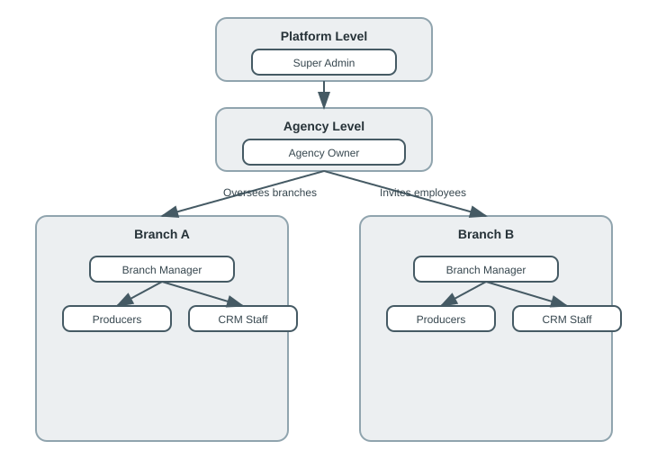
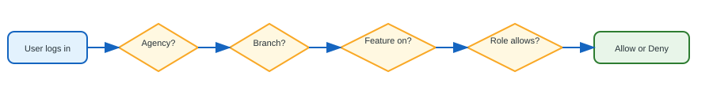
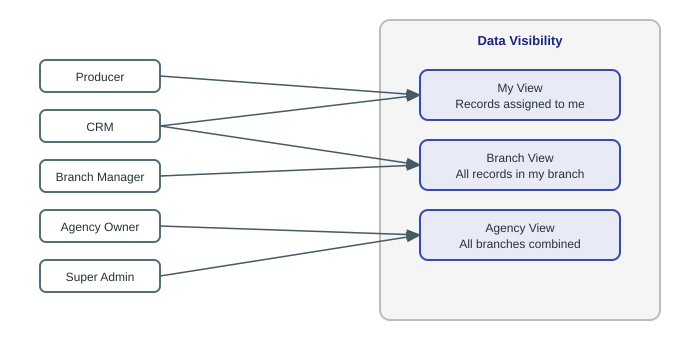
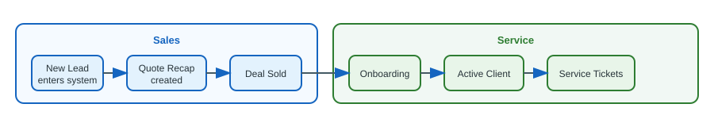
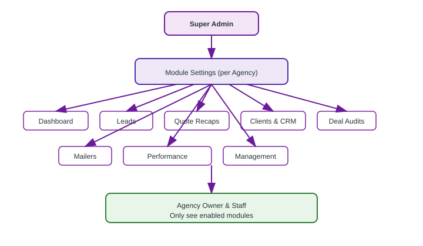
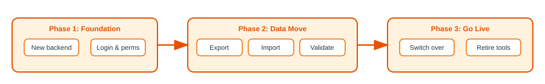
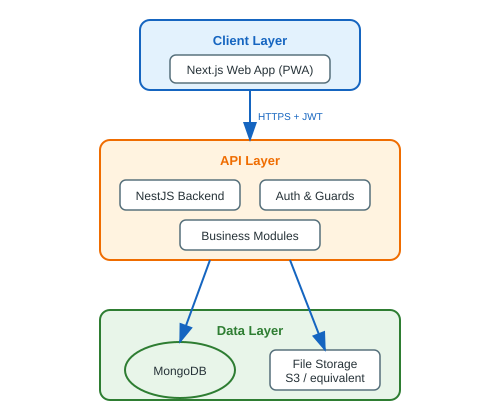
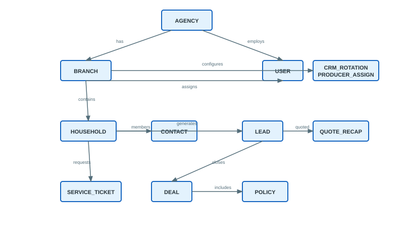
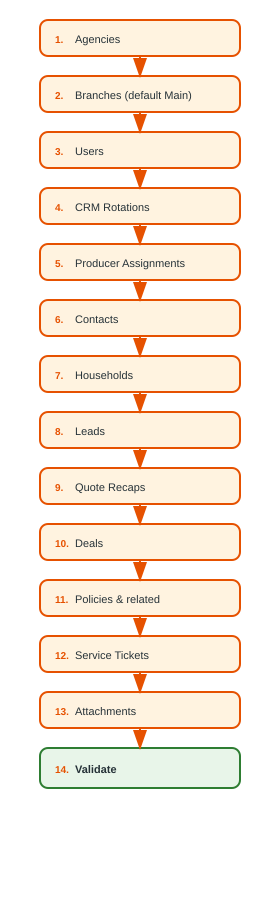

# SFA Platform — System Architecture Document

**Version:** 1.0  
**Status:** Approved for planning  
**Last updated:** July 2, 2026  
**Audience:** Engineering, product, and management

---

## Table of Contents

1. [Executive Summary](#1-executive-summary)
2. [Vision & Goals](#2-vision--goals)
3. [Management Overview (Non-Technical)](#3-management-overview-non-technical)
4. [Current State](#4-current-state)
5. [Target State](#5-target-state)
6. [Organizational Model](#6-organizational-model)
7. [Permission & Access Control](#7-permission--access-control)
8. [Module Entitlements](#8-module-entitlements)
9. [Technical Architecture](#9-technical-architecture)
10. [Data Model](#10-data-model)
11. [Data Migration Strategy](#11-data-migration-strategy)
12. [Third-Party Removal](#12-third-party-removal)
13. [Implementation Roadmap](#13-implementation-roadmap)
14. [Risks & Mitigations](#14-risks--mitigations)
15. [Glossary](#15-glossary)
16. [Appendix: Decision Log](#16-appendix-decision-log)

---

## 1. Executive Summary

The SFA platform is being rebuilt from a single-application setup that depends on external services (SmartSuite, Clerk, Fillout, BigQuery) into a **self-contained, multi-tenant system** owned and operated by us.

### What is changing

| Area | Today | Future |
|------|-------|--------|
| Data storage | SmartSuite (external CRM) | MongoDB (our database) |
| Backend | Next.js API routes (monolith) | NestJS API (dedicated backend) |
| Authentication | Clerk (third party) | Built-in login & user management |
| Forms | Fillout (embedded forms) | Native forms inside the app |
| Tenancy | Single agency | Multiple agencies, each with multiple branches |
| Access control | Role-based (informal) | Role + module + branch permissions |

### Why we are doing this

- **Ownership** — Full control over data, features, and uptime.
- **Scalability** — Onboard new agencies and branches without re-architecting.
- **Security** — Consistent, enforceable permissions at every layer.
- **Cost & complexity** — Fewer third-party subscriptions and integration points.
- **Product velocity** — Ship features without being limited by external tools.

---

## 2. Vision & Goals

### Vision

A permission-based insurance agency operations platform where:

- A **platform administrator** manages agencies and turns features on or off per agency.
- An **agency owner** oversees all branches under their agency.
- **Branch staff** work within their branch with access only to what their role and enabled modules allow.

### Goals

| # | Goal | Success criteria |
|---|------|------------------|
| G1 | Migrate all existing SmartSuite data to MongoDB | Record counts match; relationships intact |
| G2 | Remove Clerk, Fillout, and SmartSuite dependencies | Zero runtime calls to removed services |
| G3 | Support multi-agency, multi-branch tenancy | Agency owner sees all branches; staff see their branch |
| G4 | Enforce module-based permissions | Disabled modules are invisible and inaccessible |
| G5 | Preserve existing business workflows | Lead intake, round-robin, deal audits, CRM service |

### Out of scope (initial release)

- Payment processing / billing between agencies and platform
- White-label per-agency branding (can be added later)
- Mobile native apps (PWA remains supported)

---

## 3. Management Overview (Non-Technical)

This section is written for leadership and operations staff who need to understand **how the system is organized** and **how people and data flow through it** — without implementation detail.

> **Note:** Diagrams below are visual flowcharts (SVG images). They render in GitHub, VS Code/Cursor markdown preview, and PDF exports. Source files are in [`docs/diagrams/`](diagrams/).

### 3.1 Who Uses the System?



**Key idea:** One agency owner spans all branches. Day-to-day employees belong to a specific branch.

---

### 3.2 How Access Works (Simple View)

Think of access as three questions the system asks on every action:



| Question | Who decides | Example |
|----------|-------------|---------|
| Which agency? | System (from login) | Smith Family Agency |
| Which branch? | User assignment | Downtown Office |
| Is feature on? | Super Admin | Leads module enabled, Mailers disabled |
| Does role allow? | Agency Owner (role assignment) | Producer can view own leads, not all agency leads |

---

### 3.3 What Can Each Person See?



| Role | Typical view |
|------|--------------|
| Producer | My leads, my performance |
| CRM | My tickets + branch clients |
| Branch Manager | Entire branch |
| Agency Owner | Entire agency (all branches) |
| Super Admin | Any agency (support & configuration) |

---

### 3.4 Business Workflow: Lead to Client

This is the core sales and service journey, unchanged in intent — only the underlying system changes.



| Stage | Who is involved | What happens |
|-------|-----------------|--------------|
| New Lead | Producer (assigned via round-robin) | Contact & household created |
| Quote Recap | Producer | Premium and products recorded |
| Sold | Producer / Admin | Deal created, policies linked |
| Onboarding | CRM / Operations | Deal audit and onboarding checklist |
| Active Client | CRM | Ongoing service and tickets |

All records are tied to a **branch** so each office sees its own pipeline, while the agency owner can see everything.

---

### 3.5 Feature Modules (What Super Admin Controls)

Modules are the major sections of the app. Super Admin can enable or disable each module **per agency**.



**Example:** If "Mailers" is off for Agency X, nobody at Agency X sees the Mailers menu or can access mailer data — regardless of their role.

---

### 3.6 Migration Journey (What to Expect)



| Phase | Business impact |
|-------|-----------------|
| Foundation | None — built in parallel |
| Data migration | Testing on staging copy |
| Go live | Short read-only window during cutover |
| Cleanup | Old tools decommissioned |

---

### 3.7 Before & After (Management Snapshot)


**Bottom line for management:** Staff still use one application. Behind the scenes, we own the database, login, and forms. New agencies and branches can be added without new third-party contracts.

---

## 4. Current State

### 4.1 Architecture today

The existing application (`SFA/`) is a **Next.js 14 monolith** with:

- **69 API routes** handling all server logic
- **SmartSuite** as the primary data store (15+ tables)
- **Clerk** for authentication and invitations
- **Fillout** for lead intake, quote recaps, sold logs, and service tickets
- **BigQuery** for mailer prospect lookup

There is no traditional database, no formal agency entity, and no branch concept. "Agency view" is a filter for admin users within a single organization.

### 4.2 Current data entities (SmartSuite tables)

| Entity | Purpose |
|--------|---------|
| Users | Employees, producers, CRM staff |
| Contacts | Individual people |
| Households | Family / property grouping |
| Leads | Sales opportunities |
| Quote Recaps | Quoting activity |
| Deals (Sold Log) | Closed business |
| Policies | Insurance policies on deals |
| Service Tickets | CRM service requests |
| CRM Rotation | Round-robin CRM assignment config |
| Producer Assignment | Round-robin producer assignment state |

### 4.3 Current limitations

- Single-tenant in practice (one agency, one Clerk organization)
- Permissions enforced inconsistently across routes and UI
- No module on/off per customer
- No branch isolation
- Dependent on external uptime and API limits
- Form workflows require Fillout subscription and webhook maintenance

---

## 5. Target State

### 5.1 High-level architecture



### 5.2 Repository structure (planned)

```
SFA-apps/
├── packages/
│   ├── api/              # NestJS backend
│   ├── web/              # Next.js frontend (evolved from SFA/)
│   └── shared/           # Shared types, enums, DTOs
├── scripts/
│   └── migration/        # SmartSuite → MongoDB migration
└── docs/
    └── SYSTEM_ARCHITECTURE.md   # This document
```

### 5.3 Design principles

1. **Tenant isolation first** — Every record has `agencyId`; branch-scoped records also have `branchId`.
2. **Permissions enforced server-side** — UI hiding is not security; the API must reject unauthorized access.
3. **Migration traceability** — Every migrated record keeps a `legacySmartSuiteId` for audit and rollback.
4. **Module gates** — Features are inaccessible when disabled, not merely hidden.
5. **Branch-aware by default** — Schema supports multiple branches from day one, even if we launch with one.

---

## 6. Organizational Model

### 6.1 Hierarchy

```
Platform
└── Super Admin
      │
      └── Agency (tenant)
            ├── Agency Owner          ← shared across all branches
            ├── Module entitlements   ← set by Super Admin
            │
            ├── Branch A
            │     ├── Branch Manager (optional)
            │     ├── Producers, CRM, CSR, etc.
            │     └── Operational data
            │
            └── Branch B
                  └── (same structure)
```

### 6.2 Role placement

| Role | Scope | `branchId` |
|------|-------|------------|
| `super_admin` | Platform | `null` |
| `agency_owner` | Agency (all branches) | `null` |
| `branch_manager` | Single branch | Required |
| `office_manager` | Agency or branch (TBD) | TBD |
| `data_team` | Agency-wide reporting | `null` or per branch |
| `producer` | Single branch | Required |
| `crm` | Single branch | Required |
| `csr` | Single branch | Required |
| `referral_partner` | Single branch | Required |

### 6.3 Agency vs branch responsibilities

| Concern | Agency level | Branch level |
|---------|--------------|--------------|
| Ownership | Agency Owner | Branch Manager (operational) |
| Feature access | Module on/off (Super Admin) | N/A |
| Employee management | Agency Owner invites | Assigned to a branch |
| CRM data | Aggregated view | Day-to-day records |
| Round-robin config | N/A | Per-branch rotation rules |
| Reporting | Agency-wide dashboards | Branch dashboards |

### 6.4 Multi-branch rules

- **One agency owner** per agency, spanning all branches.
- **Employees** are assigned to exactly **one primary branch** (default).
- **Operational data** (leads, deals, households) belongs to one branch.
- **Household transfer** between branches is a controlled action (audit logged), not a duplicate record.
- **Launch default:** Smith Family Agency → one "Main" branch; schema ready for additional branches.

---

## 7. Permission & Access Control

### 7.1 Four-layer guard model

Every API request passes through four checks:


#### Authorization source of truth (PAC-25)

The JWT is used for **authentication + stable identity claims only**. The
**effective permission set is resolved from the backend store (MongoDB) on every
authenticated request** — it is *not* trusted from the token. Immediately after
`JwtAuthGuard`, an `AccessContextGuard` resolves the caller's live
`AccessContext` (permissions, data scope, tenant/branch, active flag) via
`AccessResolverService` and attaches it to `request.access`; every downstream
guard reads from there.

Consequences:

- Owner permission/role edits and user de-provisioning take effect on the
  **next request** — no re-login and no waiting for the token to expire.
- A deactivated/deleted user is rejected even while holding a still-valid token.

**Optional Redis cache.** Resolution always reads from MongoDB unless `REDIS_URL`
is configured, in which case resolved contexts are cached in Redis (with a safety
TTL) to avoid a DB read per request. Redis is strictly optional — behavior is
identical either way. Cache entries are explicitly invalidated when a role's
levels change (all members), a user's role/overrides change (that user), or an
agency's module entitlements change (all members).

### 7.2 Scope matrix

| Actor | Agency data | Branch data | Module disabled |
|-------|-------------|-------------|-----------------|
| Super Admin | All agencies | All branches | Bypass for admin config only |
| Agency Owner | Full agency | All branches | Denied |
| Branch Manager | None (unless also owner) | Own branch | Denied |
| Producer | None | Own records | Denied |
| CRM | None | Branch clients & tickets | Denied |

### 7.3 Data visibility scopes (UI)

| Scope | Filter | Available to |
|-------|--------|--------------|
| **My** | `assignedUserId = me` | Producer, CRM |
| **Branch** | `branchId = my branch` | Branch Manager, CRM (extended) |
| **Agency** | `agencyId = my agency` | Agency Owner, Data Team |

### 7.4 Capability examples

| Capability | super_admin | agency_owner | branch_manager | producer | crm |
|------------|:-----------:|:------------:|:--------------:|:--------:|:---:|
| Manage agencies | ✓ | | | | |
| Toggle modules | ✓ | | | | |
| Invite users | ✓ | ✓ | | | |
| Manage branches | ✓ | ✓ | | | |
| View agency leads | ✓ | ✓ | | | |
| View branch leads | ✓ | ✓ | ✓ | | ✓ |
| View own leads | | ✓ | ✓ | ✓ | |
| Run deal audits | | ✓ | ✓ | ✓ | ✓ |
| Edit a client contact | | ✓ | ✓ | ✓¹ | ✓ |

¹ Producers hold `clients:write` (added by PAC-38 for the Lead Detail contact
edit), but `Contact` carries no `producerId`, so their `own` scope cannot be a
field comparison. `ContactAccessService` **derives** it: a producer may edit a
contact only if they own a lead that reaches it, directly or through its
household. Everything else in the `clients` module remains out of their reach.

---

## 8. Module Entitlements

### 8.1 Module catalog

| Module key | Name | Description |
|------------|------|-------------|
| `dashboard` | Dashboard | Overview widgets and KPIs |
| `leads` | Leads | Lead pipeline and intake |
| `quote_recaps` | Quote Recaps | Quoting workflow |
| `mailers` | Mailers | Mailer prospect lookup |
| `crm_service` | CRM Service | Service ticket queue |
| `clients` | Clients | Sold households and client detail |
| `deal_audits` | Deal Audits | Post-sale audit queue |
| `onboardings` | Onboardings | Onboarding tracker |
| `management` | Management | Office volume and ops |
| `owner_dashboard` | Owner Dashboard | Agency-wide executive view |
| `command_center` | Command Center | Data team reconciliation |
| `performance` | Performance | Producer performance |
| `leaderboard` | Leaderboard | Rankings and competition |

### 8.2 Entitlement rules

- Modules are toggled **per agency** by Super Admin.
- Agency Owner **cannot** enable modules — they only use what is enabled.
- When a module is disabled:
  - Navigation item is hidden
  - API returns `403 Module Disabled`
  - No data from that module is queryable

### 8.3 Entitlement data shape

```javascript
// Stored on agency document or separate entitlements collection
{
  agencyId: ObjectId,
  modules: {
    leads:           { enabled: true,  enabledAt: Date, enabledBy: ObjectId },
    deal_audits:     { enabled: true,  enabledAt: Date, enabledBy: ObjectId },
    mailers:         { enabled: false },
    command_center:  { enabled: true,  enabledAt: Date, enabledBy: ObjectId },
    // ...
  }
}
```

---

## 9. Technical Architecture

### 9.1 NestJS module structure

```
src/
├── common/
│   ├── guards/           # JwtAuth, Tenant, Branch, Module, Permissions
│   ├── decorators/       # @CurrentUser, @AgencyId, @BranchId, @RequireModule
│   └── interceptors/
├── auth/                 # Login, JWT, invites, password reset
├── platform/             # Super Admin: agencies, module entitlements
├── branches/             # Branch CRUD
├── users/                # User management, roles
├── contacts/
├── households/
├── leads/
│   └── intake/           # Lead intake pipeline (ported from current lib/intake)
├── quote-recaps/
├── deals/
│   ├── policies/
│   └── deal-audits/
├── crm/
│   ├── service-tickets/
│   └── assignment/       # Round-robin (per branch)
├── performance/
├── mailers/
├── onboardings/
└── files/                # Attachments (quote PDFs, etc.)
```

### 9.2 Authentication

| Concern | Approach |
|---------|----------|
| Login | Email + password (bcrypt hashed) |
| Session | JWT access token + refresh token |
| Invitations | Agency Owner sends invite link; user sets password on accept |
| Super Admin | Seeded account; platform scope |
| Password reset | Email-based token flow |

**JWT payload (slim — identity claims only):**

```typescript
{
  sub: string;              // userId
  agencyId: string | null;  // null for super_admin
  branchId: string | null;  // null for agency-wide roles
  scope: 'platform' | 'agency' | 'branch';
  isPlatformAdmin: boolean;
}
```

The token intentionally does **not** carry the effective permission set — that is
resolved live from the store per request (see §7.1). The login response still
returns the resolved `permissions` / `dataScope` / role names for the web app to
gate its UI.

Agency Owners may pass `X-Branch-Id` header to filter UI to a specific branch without losing agency-wide access.

### 9.3 Frontend (Next.js)

- UI-only responsibilities: rendering, forms, client-side validation
- All data fetching via NestJS API
- Auth context replaces Clerk provider
- Native forms replace Fillout embeds
- Navigation driven by **role + module entitlements**
- Branch switcher in header for Agency Owner

### 9.4 Request flow (technical)


---

## 10. Data Model

### 10.1 Core collections

| Collection | Scope | Key fields |
|------------|-------|------------|
| `agencies` | Platform | name, slug, status, modules, settings |
| `branches` | Agency | agencyId, name, slug, isDefault, settings |
| `users` | Agency / Branch | agencyId, branchId, roles, email, profile |
| `contacts` | Branch | agencyId, branchId, householdId, name, email, phone, dob |
| `households` | Branch | agencyId, branchId, primaryContactId, address, assignedCrmId |
| `leads` | Branch | agencyId, branchId, householdId, producerId, leadSource, status |
| `quote_recaps` | Branch | agencyId, branchId, leadId, producerId, premium, quoteDate |
| `deals` | Branch | agencyId, branchId, leadId, producerId, crmId, soldDate, auditStatus |
| `policies` | Branch | agencyId, branchId, dealId, policyType, premium |
| `service_tickets` | Branch | agencyId, branchId, householdId, assignedCrmId, status |
| `crm_rotations` | Branch | agencyId, branchId, crmUserId, order, active |
| `producer_assignments` | Branch | agencyId, branchId, producerId, pointer, lastAssignedCrmId |
| `migration_id_map` | System | entityType, legacySmartSuiteId, mongoId |
| `household_transfers` | Audit | householdId, fromBranchId, toBranchId, transferredBy |

### 10.2 Entity relationship diagram



### 10.3 Migration-friendly conventions

Every migrated document includes:

```javascript
{
  agencyId: ObjectId,           // required on tenant data
  branchId: ObjectId,           // required on operational data
  legacySmartSuiteId: String,   // original SmartSuite record ID
  createdAt: Date,
  updatedAt: Date,
}
```

### 10.4 Indexing strategy

```javascript
// Tenant isolation (all collections)
{ agencyId: 1, branchId: 1, createdAt: -1 }

// Migration reconciliation
{ legacySmartSuiteId: 1 }  // unique, sparse

// Assignment queries
{ agencyId: 1, branchId: 1, producerId: 1 }
{ agencyId: 1, branchId: 1, assignedCrmId: 1 }

// Dedup (intake)
{ agencyId: 1, branchId: 1, submissionToken: 1 }  // unique
```

### 10.5 Branch assignment on create

| Entity | `branchId` source |
|--------|-------------------|
| Lead (internal) | Submitting user's branch |
| Lead (public) | Form selection, zip/territory, or default branch |
| Household / Contact | Same branch as originating lead |
| Deal | Lead's branch |
| Service ticket | Household's branch |
| User invite | Selected by inviter (Agency Owner) |

---

## 11. Data Migration Strategy

### 11.1 Source systems

| Source | Data |
|--------|------|
| SmartSuite | All CRM entities (15+ tables) |
| Clerk | User emails, roles, metadata (SmartSuite user link) |
| SmartSuite file API | Quote recap attachments |
| BigQuery (optional) | Mailer prospect data |

### 11.2 Migration order

Dependencies must be respected. Migrate in this sequence:



### 11.3 ID mapping

A central `migration_id_map` collection translates SmartSuite IDs to MongoDB ObjectIds during import:

```javascript
{ entityType: "leads", legacySmartSuiteId: "abc123", mongoId: ObjectId("...") }
```

All foreign-key resolution uses this map. Existing normalization logic in `SFA/lib/smartsuite/` and `SFA/lib/intake/` is ported to migration scripts.

### 11.4 Initial tenant setup

For the current Smith Family Agency deployment:

| New entity | Initial value |
|------------|---------------|
| Agency | Smith Family Agency |
| Branch | Main (isDefault: true) |
| Users | All assigned to Main branch; owner has branchId: null |
| Data | All records get Main branchId |

### 11.5 Validation checklist

| Check | Method |
|-------|--------|
| Record counts | SmartSuite count = MongoDB count per entity |
| Orphan references | Every FK resolves via id map |
| User login | Each migrated user authenticates successfully |
| Scope enforcement | Producer sees only own leads; owner sees all |
| Round-robin state | Producer assignment pointers preserved |
| Attachments | Files accessible at new URLs |
| Branch coverage | No operational record missing branchId |

### 11.6 Cutover plan

| Step | Action |
|------|--------|
| T-7 days | Full migration to staging; validation pass |
| T-1 day | Incremental delta migration |
| T-0 | Freeze SmartSuite writes (maintenance banner) |
| T-0 | Final delta migration |
| T-0 | Switch production to NestJS API + MongoDB |
| T+7 days | SmartSuite read-only (rollback safety) |
| T+30 days | Decommission SmartSuite, Clerk, Fillout |

---

## 12. Third-Party Removal

| Service | Replacement |
|---------|-------------|
| **Clerk** | NestJS JWT auth + invite flow |
| **Fillout** | Native React forms in Next.js |
| **SmartSuite** | MongoDB + NestJS services |
| **BigQuery** | `mailers` MongoDB collection (import) or CSV upload |
| **Svix** | Removed (Clerk webhooks eliminated) |

### Fillout forms → native UI

| Former Fillout form | New location |
|---------------------|--------------|
| New Lead 2.0 | `/leads/new` |
| Quote Recap | `/quote-recaps/new` |
| Sold Log / Mark Sold | `/leads/[id]/mark-sold` |
| Service Ticket | Client detail modal |
| New Employee | `/settings/users/invite` |
| Referral form | `/referrals/new` |

Business logic in `SFA/lib/intake/` ports directly to NestJS services.

---

## 13. Implementation Roadmap

### Phase 1: Foundation (4–6 weeks)

- [ ] NestJS project scaffold with MongoDB (Mongoose)
- [ ] Auth module (login, JWT, invites)
- [ ] Agency, branch, and user models
- [ ] Four-layer permission guards
- [ ] Module entitlement model
- [ ] Super Admin seed + default agency/branch

### Phase 2: Data migration (4–6 weeks)

- [ ] Field mapping manifest from SmartSuite
- [ ] Migration scripts (ordered pipeline)
- [ ] ID mapping and validation suite
- [ ] Staging migration with iterative fixes
- [ ] Port intake pipeline (`processNewLead`)

### Phase 3: API parity (6–8 weeks)

- [ ] Port critical API routes to NestJS (prioritize by usage)
- [ ] CRM round-robin (per branch)
- [ ] Deal audit workflow
- [ ] Performance and dashboard aggregations
- [ ] File upload for attachments

### Phase 4: Frontend refactor (4–6 weeks)

- [ ] Remove Clerk; custom auth context
- [ ] Point all data fetching to NestJS API
- [ ] Replace Fillout embeds with native forms
- [ ] Module-aware navigation
- [ ] Branch switcher for Agency Owner
- [ ] Super Admin agency/module management UI

### Phase 5: Cutover & cleanup (2–4 weeks)

- [ ] Production cutover
- [ ] Remove SmartSuite, Clerk, Fillout code and dependencies
- [ ] Documentation and runbooks

**Estimated total: 20–28 weeks** (Phases 3 and 4 can overlap after Phase 2 stabilizes)

---

## 14. Risks & Mitigations

| Risk | Impact | Mitigation |
|------|--------|------------|
| SmartSuite field mapping incomplete | Data loss or corruption | Field manifest from API + code audit before migration |
| Broken relationships after migration | Orphan records | ID map + automated orphan detection |
| Attachment loss | Missing quote PDFs | Download all files during migration; verify URLs |
| Permission regression | Unauthorized access | Automated role × module × action test matrix |
| Cutover downtime | Business disruption | Read-only freeze + delta script; rollback window |
| Single-tenant → multi-tenant | Schema rework later | agencyId + branchId on all docs from day one |
| Round-robin state corruption | Wrong producer assignment | Migrate pointers as-is; test assignment post-migration |
| Scope creep | Delayed launch | Phase gates; MVP module set for go-live |

---

## 15. Glossary

| Term | Definition |
|------|------------|
| **Agency** | A customer organization (tenant) using the platform |
| **Branch** | A physical or logical office within an agency |
| **Agency Owner** | Top role within an agency; sees all branches |
| **Super Admin** | Platform operator; manages agencies and module access |
| **Module** | A major feature area (Leads, Clients, etc.) that can be enabled per agency |
| **Entitlement** | Whether a module is on or off for a given agency |
| **Scope** | My / Branch / Agency — how wide a user's data view is |
| **Tenant** | Synonym for agency in technical context (`agencyId`) |
| **Round-robin** | Automatic rotation assigning leads to producers or CRMs |
| **Intake** | Process of creating contact, household, and lead from a submission |
| **Deal audit** | Post-sale review workflow on closed deals |
| **Legacy ID** | Original SmartSuite record ID kept for migration audit |

---

## 16. Appendix: Decision Log

| # | Decision | Rationale | Date |
|---|----------|-----------|------|
| D1 | MongoDB over SQL | Flexible schema aids migration; document model fits nested insurance data | 2026-07-02 |
| D2 | NestJS for backend | Structured modules, guards, and DI suit permission-heavy API | 2026-07-02 |
| D3 | Module toggles at agency level | Super Admin contract control; branches share entitlements | 2026-07-02 |
| D4 | One primary branch per employee | Simplifies permissions; multi-branch via exception later | 2026-07-02 |
| D5 | Default branch for migration | Smith Family → "Main" branch; all data backfilled | 2026-07-02 |
| D6 | Keep legacySmartSuiteId | Audit trail and rollback capability | 2026-07-02 |
| D7 | Self-hosted auth (no Clerk) | Third-party removal goal; full control | 2026-07-02 |
| D8 | Native forms (no Fillout) | Third-party removal; better UX integration | 2026-07-02 |

### Open decisions (to confirm)

| # | Question | Options | Recommendation |
|---|----------|---------|----------------|
| O1 | Is `office_manager` agency-wide or per-branch? | Agency / Branch | Per-branch `branch_manager` unless ops needs agency-wide |
| O2 | Import BigQuery mailers or defer? | Import / Defer / CSV upload | Import to `mailers` collection if volume is manageable |
| O3 | File storage provider? | S3 / GCS / GridFS | S3 or GCS for production |
| O4 | API style? | REST / GraphQL | REST (matches current Next.js API patterns) |

---

## Document control

| Version | Date | Author | Changes |
|---------|------|--------|---------|
| 1.0 | 2026-07-02 | Architecture team | Initial architecture document |

---

*This document is the authoritative reference for the SFA platform rebuild. All engineering, product, and migration work should align with the models, permissions, and phases defined here.*
